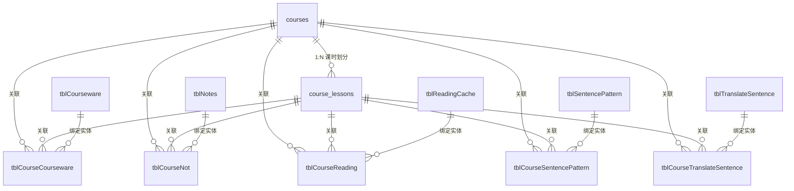

# vCourse.ThaiNotes 数据库表设计文档 (Database Schema Design)

本设计文档旨在梳理并记录泰语学习系统（SQLite 数据库）中所有数据表结构设计、数据字典及关联关系模式。

---

## 1. 数据库设计理念与核心架构

系统采用 **“核心课程总线 + 独立模块实体 + 关联关系映射”** 的设计理念：
1. **核心课程总线 (`courses` & `course_lessons`)**：作为全系统的骨架，统一管理系统的科目和章节课时。
2. **独立模块实体**：各个 App 模块（如随堂笔记、精读短文、语法句型、课件 PDF）维护自己纯粹的业务实体表，不直接依赖科目与课时。
3. **关联关系映射（Many-to-Many Join Tables）**：通过外键关系，在各自关联表中实现科目、课时与模块实体的一对多或多对多绑定。这保证了不同模块实体可灵活重用。
4. **轻量 JSON 存储**：为规避 SQLite 单一文件结构关系设计过于冗杂，对非关系型扩展属性（如选项列表、例句数组、课件配套指南数据）采用 JSON 字符串格式直接存储在列中。

---

## 2. 实体关系图 (ER Diagram)

下面的 Mermaid 图表展示了核心课程体系如何作为总线枢纽关联各个 App 的实体数据：

---

## 3. 数据表字典详情 (Table Dictionaries)

### 3.1 核心课程体系 (Core Course Hub)

#### 3.1.1 科目表 (`courses`)
统一存放系统中的科目分类。

| 字段名 | 类型 | 约束 | 默认值 | 说明 |
| :--- | :--- | :--- | :--- | :--- |
| `id` | TEXT | PRIMARY KEY | - | 科目唯一标识 (如 `course_001`) |
| `name` | TEXT | NOT NULL | - | 科目名称 (如 `基础泰语2`) |
| `description` | TEXT | NULL | - | 科目简介/说明 |
| `created_at` | TEXT | - | `datetime('now', 'localtime')` | 创建时间 |
| `updated_at` | TEXT | - | `datetime('now', 'localtime')` | 修改时间 |

#### 3.1.2 课时章节表 (`course_lessons`)
管理每一个科目下的课时章节列表。

| 字段名 | 类型 | 约束 | 默认值 | 说明 |
| :--- | :--- | :--- | :--- | :--- |
| `id` | TEXT | PRIMARY KEY | - | 课时唯一标识 (如 `lesson_001`) |
| `course_id` | TEXT | FOREIGN KEY REFERENCES `courses(id)` ON DELETE CASCADE | - | 关联科目 ID |
| `sort_order` | INTEGER | NOT NULL | - | 课时排序序号 (如 1, 2, 3...) |
| `title` | TEXT | NOT NULL | - | 课时章节标题 |
| `content_json` | TEXT | NOT NULL | - | 课时其它关联属性 (轻量 JSON 存储) |
| `created_at` | TEXT | - | `datetime('now', 'localtime')` | 创建时间 |
| `updated_at` | TEXT | - | `datetime('now', 'localtime')` | 修改时间 |

---

### 3.2 课件讲义模块 (Courseware App)

#### 3.2.1 课件实体表 (`tblCourseware`)
存储讲义文档 PDF 路径以及配套的多维度导学数据结构。

| 字段名 | 类型 | 约束 | 默认值 | 说明 |
| :--- | :--- | :--- | :--- | :--- |
| `uuid` | TEXT | PRIMARY KEY | - | 课件 UUID 唯一标识 |
| `title` | TEXT | NOT NULL | - | 课件标题 |
| `tags` | TEXT | NULL | - | 标签分类 (逗号分隔) |
| `coursewareURI`| TEXT | NULL | - | 课件 PDF 相对路径 (如 `coursewares/file.pdf`) |
| `studyGuide` | TEXT | NULL | - | 关卡导学结构 (预热、单页问题、总结) - **JSON 字符串** |
| `pageMarkdowns`| TEXT | NULL | - | 讲义每一页正文原文 Markdown 映射 - **JSON 字符串** |
| `quizCheck` | TEXT | NULL | - | 讲义每一页的随堂自测 MCQ 试题数据 - **JSON 字符串** |
| `created_at` | TEXT | - | `datetime('now', 'localtime')` | 创建时间 |

#### 3.2.2 课时课件关联表 (`tblCourseCourseware`)
建立课件与具体科目/课时的多对多绑定。

| 字段名 | 类型 | 约束 | 默认值 | 说明 |
| :--- | :--- | :--- | :--- | :--- |
| `id` | INTEGER | PRIMARY KEY AUTOINCREMENT | - | 自增主键 ID |
| `course_id` | TEXT | FOREIGN KEY REFERENCES `courses(id)` ON DELETE CASCADE | - | 科目外键 ID |
| `lesson_id` | TEXT | FOREIGN KEY REFERENCES `course_lessons(id)` ON DELETE CASCADE | - | 课时外键 ID |
| `courseware_uuid`| TEXT | FOREIGN KEY REFERENCES `tblCourseware(uuid)` ON DELETE CASCADE | - | 课件外键 UUID |
| `created_at` | TEXT | - | `datetime('now', 'localtime')` | 绑定时间 |

---

### 3.3 随堂笔记模块 (Notes App)

#### 3.3.1 笔记实体表 (`tblNotes`)
记录笔记详情。

| 字段名 | 类型 | 约束 | 默认值 | 说明 |
| :--- | :--- | :--- | :--- | :--- |
| `uuid` | TEXT | PRIMARY KEY | - | 笔记唯一标识 UUID |
| `topic` | TEXT | NULL | - | 笔记主题 |
| `tags` | TEXT | NULL | - | 标签属性 |
| `noteContent` | TEXT | NOT NULL | - | 笔记富文本/Markdown 主体内容 |
| `created_at` | TEXT | - | `datetime('now', 'localtime')` | 创建时间 |

#### 3.3.2 课时笔记关联表 (`tblCourseNot`)
建立随堂笔记与科目/课时的多对多绑定。

| 字段名 | 类型 | 约束 | 默认值 | 说明 |
| :--- | :--- | :--- | :--- | :--- |
| `id` | INTEGER | PRIMARY KEY AUTOINCREMENT | - | 自增主键 ID |
| `course_id` | TEXT | FOREIGN KEY REFERENCES `courses(id)` ON DELETE CASCADE | - | 科目外键 ID |
| `lesson_id` | TEXT | FOREIGN KEY REFERENCES `course_lessons(id)` ON DELETE CASCADE | - | 课时外键 ID |
| `note_uuid` | TEXT | FOREIGN KEY REFERENCES `tblNotes(uuid)` ON DELETE CASCADE | - | 笔记外键 UUID |
| `created_at` | TEXT | - | `datetime('now', 'localtime')` | 绑定时间 |

---

### 3.4 句型分析模块 (Sentence Pattern App)

#### 3.4.1 句型实体表 (`tblSentencePattern`)
记录核心泰语句型模型。

| 字段名 | 类型 | 约束 | 默认值 | 说明 |
| :--- | :--- | :--- | :--- | :--- |
| `uuid` | TEXT | PRIMARY KEY | - | 句型唯一标识 UUID |
| `tags` | TEXT | NULL | - | 标签分类 |
| `patternContent`| TEXT | NOT NULL | - | 句型详细拆解结构 - **JSON 字符串** |
| `created_at` | TEXT | - | `datetime('now', 'localtime')` | 创建时间 |

#### 3.4.2 课时句型关联表 (`tblCourseSentencePattern`)

| 字段名 | 类型 | 约束 | 默认值 | 说明 |
| :--- | :--- | :--- | :--- | :--- |
| `id` | INTEGER | PRIMARY KEY AUTOINCREMENT | - | 自增主键 ID |
| `course_id` | TEXT | FOREIGN KEY REFERENCES `courses(id)` ON DELETE CASCADE | - | 科目外键 ID |
| `lesson_id` | TEXT | FOREIGN KEY REFERENCES `course_lessons(id)` ON DELETE CASCADE | - | 课时外键 ID |
| `pattern_uuid` | TEXT | FOREIGN KEY REFERENCES `tblSentencePattern(uuid)` ON DELETE CASCADE | - | 句型外键 UUID |
| `created_at` | TEXT | - | `datetime('now', 'localtime')` | 绑定时间 |

---

### 3.5 短文阅读模块 (Reading Coach App)

#### 3.5.1 精读文章实体表 (`tblReadingCache`)
记录阅读教练中使用的短文及其配套词汇和测验结构。

| 字段名 | 类型 | 约束 | 默认值 | 说明 |
| :--- | :--- | :--- | :--- | :--- |
| `uuid` | TEXT | PRIMARY KEY | - | 文章唯一标识 UUID |
| `title` | TEXT | NOT NULL | - | 文章标题 |
| `subject` | TEXT | NULL | - | 文章题材分类 |
| `difficulty` | REAL | NULL | - | 难度评级指数 |
| `word_count` | INTEGER | NULL | - | 短文总词数 |
| `content_json` | TEXT | NOT NULL | - | 精读段落、词汇释义及阅读理解题 - **JSON 字符串** |
| `created_at` | TEXT | - | `datetime('now', 'localtime')` | 创建时间 |

#### 3.5.2 课时阅读关联表 (`tblCourseReading`)

| 字段名 | 类型 | 约束 | 默认值 | 说明 |
| :--- | :--- | :--- | :--- | :--- |
| `id` | INTEGER | PRIMARY KEY AUTOINCREMENT | - | 自增主键 ID |
| `course_id` | TEXT | FOREIGN KEY REFERENCES `courses(id)` ON DELETE CASCADE | - | 科目外键 ID |
| `lesson_id` | TEXT | FOREIGN KEY REFERENCES `course_lessons(id)` ON DELETE CASCADE | - | 课时外键 ID |
| `reading_uuid` | TEXT | FOREIGN KEY REFERENCES `tblReadingCache(uuid)` ON DELETE CASCADE | - | 文章外键 UUID |
| `created_at` | TEXT | - | `datetime('now', 'localtime')` | 绑定时间 |

---

### 3.6 翻译练习模块 (Translation App)

#### 3.6.1 翻译句子实体表 (`tblTranslateSentence`)
记录翻译练习涉及的例句。

| 字段名 | 类型 | 约束 | 默认值 | 说明 |
| :--- | :--- | :--- | :--- | :--- |
| `uuid` | TEXT | PRIMARY KEY | - | 句子唯一标识 UUID |
| `tags` | TEXT | NULL | - | 标签分类 |
| `jsonContent` | TEXT | NOT NULL | - | 双语释义、拆分分词结构、评测标准 - **JSON 字符串** |
| `created_at` | TEXT | - | `datetime('now', 'localtime')` | 创建时间 |

#### 3.6.2 课时翻译关联表 (`tblCourseTranslateSentence`)

| 字段名 | 类型 | 约束 | 默认值 | 说明 |
| :--- | :--- | :--- | :--- | :--- |
| `id` | INTEGER | PRIMARY KEY AUTOINCREMENT | - | 自增主键 ID |
| `course_id` | TEXT | FOREIGN KEY REFERENCES `courses(id)` ON DELETE CASCADE | - | 科目外键 ID |
| `lesson_id` | TEXT | FOREIGN KEY REFERENCES `course_lessons(id)` ON DELETE CASCADE | - | 课时外键 ID |
| `sentence_uuid`| TEXT | FOREIGN KEY REFERENCES `tblTranslateSentence(uuid)` ON DELETE CASCADE | - | 翻译句子外键 UUID |
| `created_at` | TEXT | - | `datetime('now', 'localtime')` | 绑定时间 |

---

### 3.7 独立词典与词库模块 (Standalone Dictionaries & Vocabulary)

#### 3.7.1 课时词汇表 (`vocabulary`)
存放与传统课时绑定的单词（支持可为空的课时关联以支持多维度引用）。

| 字段名 | 类型 | 约束 | 默认值 | 说明 |
| :--- | :--- | :--- | :--- | :--- |
| `id` | TEXT | PRIMARY KEY | - | 单词唯一标识 |
| `lesson_id` | TEXT | NULL | - | 关联课时 ID (可为空) |
| `sort_order` | INTEGER | NULL | - | 单词在课时中的出现顺序 |
| `headword` | TEXT | NOT NULL | - | 泰文单词拼写 |
| `pos` | TEXT | NOT NULL | - | 词性 |
| `meaning` | TEXT | NOT NULL | - | 中文释义 |
| `data_json` | TEXT | NOT NULL | - | 例句、发音音频、其它细节属性 - **JSON 字符串** |
| `created_at` | TEXT | - | `datetime('now', 'localtime')` | 创建时间 |
| `updated_at` | TEXT | - | `datetime('now', 'localtime')` | 更新时间 |

#### 3.7.2 课时语法笔记表 (`grammar_notes`)
传统课时绑定的语法知识说明。

| 字段名 | 类型 | 约束 | 默认值 | 说明 |
| :--- | :--- | :--- | :--- | :--- |
| `id` | TEXT | PRIMARY KEY | - | 语法唯一标识 |
| `lesson_id` | TEXT | NULL | - | 关联课时 ID (可为空) |
| `sort_order` | INTEGER | NULL | - | 出现顺序 |
| `title` | TEXT | NOT NULL | - | 语法点标题 |
| `category` | TEXT | NOT NULL | - | 语法分类 |
| `summary` | TEXT | NOT NULL | - | 简要概述说明 |
| `data_json` | TEXT | NOT NULL | - | 详细解说、例句与测验数组 - **JSON 字符串** |
| `created_at` | TEXT | - | `datetime('now', 'localtime')` | 创建时间 |
| `updated_at` | TEXT | - | `datetime('now', 'localtime')` | 更新时间 |

#### 3.7.3 高频词汇表 (`high_frequency_words`)
500 个高频极速卡片刷词专用库，结构独立。

| 字段名 | 类型 | 约束 | 默认值 | 说明 |
| :--- | :--- | :--- | :--- | :--- |
| `id` | TEXT | PRIMARY KEY | - | 高频词唯一 ID (如 `hfw_001`) |
| `word` | TEXT | NOT NULL | - | 泰文单词 |
| `ipa` | TEXT | NULL | - | 国际音标 (IPA) / 拼音读音 |
| `meaning` | TEXT | NOT NULL | - | 核心意思释义 |
| `options_json` | TEXT | NOT NULL | - | MCQ 快速评测用干扰项选项数组 - **JSON 字符串** |
| `examples_json`| TEXT | NULL | - | 简短双语例句结构 - **JSON 字符串** |
| `created_at` | TEXT | - | `datetime('now', 'localtime')` | 创建时间 |
| `updated_at` | TEXT | - | `datetime('now', 'localtime')` | 修改时间 |

#### 3.7.4 词汇训练集表 (`tblWordset`)
用于 Anki 及词卡应用的多词成组打包词集（如“食物”、“交通”）。

| 字段名 | 类型 | 约束 | 默认值 | 说明 |
| :--- | :--- | :--- | :--- | :--- |
| `uuid` | TEXT | PRIMARY KEY | - | 词集 UUID 标识 |
| `title` | TEXT | NOT NULL | - | 词集名称 |
| `tags` | TEXT | NULL | - | 标签分类 |
| `words` | TEXT | NOT NULL | - | 该集合包含的单词及干扰项、例句列表 - **JSON 字符串** |
| `created_at` | TEXT | - | `datetime('now', 'localtime')` | 创建时间 |

#### 3.7.5 每日错词本 (`tblDailyAnkiError`)
Anki 系统记录的日历化每日答错单词归档。

| 字段名 | 类型 | 约束 | 默认值 | 说明 |
| :--- | :--- | :--- | :--- | :--- |
| `uuid` | TEXT | PRIMARY KEY | - | 记录唯一标识 |
| `date` | TEXT | NOT NULL | - | 归属错词日期 (`YYYY-MM-DD`) |
| `errorWords` | TEXT | NOT NULL | - | 当日答错的高频词或课时词数组 - **JSON 字符串** |
| `created_at` | TEXT | - | `datetime('now', 'localtime')` | 创建时间 |

#### 3.7.6 核心词汇集表 (`tblCoreWordsets`) 与 核心词汇表 (`tblCoreWords`)
专用于课时多词汇集分组与综合核心词汇学习（多词性、多释义、泰中例句）。一个科目/课时章节下支持创建多个核心词汇集。

##### 核心词汇集表 (`tblCoreWordsets`)
| 字段名 | 类型 | 约束 | 默认值 | 说明 |
| :--- | :--- | :--- | :--- | :--- |
| `id` | TEXT | PRIMARY KEY | - | 词集标识 (如 `set_lesson_001_1`) |
| `course_id` | TEXT | NULL | - | 关联科目 ID |
| `lesson_id` | TEXT | NOT NULL | - | 关联课时章节 ID |
| `title` | TEXT | NOT NULL | - | 词集名称 (如 "第1课核心词集 1") |
| `description`| TEXT | NULL | - | 词集说明或备注 |
| `sort_order` | INTEGER | - | `0` | 课时内词集排序权重 |
| `created_at` | TEXT | - | `datetime('now', 'localtime')` | 创建时间 |
| `updated_at` | TEXT | - | `datetime('now', 'localtime')` | 修改时间 |

##### 核心词汇表 (`tblCoreWords`)
| 字段名 | 类型 | 约束 | 默认值 | 说明 |
| :--- | :--- | :--- | :--- | :--- |
| `id` | TEXT | PRIMARY KEY | - | 核心词唯一 ID (如 `cw_001`) |
| `lesson_id` | TEXT | NULL | - | 关联课时 ID |
| `set_id` | TEXT | NULL | - | 关联词汇集 ID (`tblCoreWordsets.id`) |
| `sort_order` | INTEGER | - | `0` | 词集内词条排序权重 |
| `word` | TEXT | NOT NULL | - | 泰文单词 |
| `ipa` | TEXT | NULL | - | 国际音标 (IPA) / 拼音读音 |
| `data_json` | TEXT | NOT NULL | - | 完整结构（词性、中文释义、双语例句数组等） - **JSON 字符串** |
| `created_at` | TEXT | - | `datetime('now', 'localtime')` | 创建时间 |
| `updated_at` | TEXT | - | `datetime('now', 'localtime')` | 修改时间 |

---

### 3.8 复习进度与记忆调度机制 (Spaced Repetition Review System)

#### 3.8.1 复习状态表 (`user_reviews`)
宏观艾宾浩斯/SM-2/Pimsleur 多元自适应学习算法控制表。

| 字段名 | 类型 | 约束 | 默认值 | 说明 |
| :--- | :--- | :--- | :--- | :--- |
| `id` | TEXT | PRIMARY KEY | - | 独立记录 ID (如 `user123_vocab_w005`) |
| `user_id` | TEXT | NOT NULL | - | 关联用户唯一标识 |
| `item_type` | TEXT | NOT NULL | - | 被调度实体类别: `'vocab'` \| `'grammar'` \| `'high_freq'` |
| `item_id` | TEXT | NOT NULL | - | 被调度实体的外键 ID (多态引用) |
| `scheduler_type`| TEXT | NOT NULL | - | 选用的记忆算法: `'sm2'` \| `'pimsleur'` |
| `interval_minutes`|INTEGER | - | `1440` | 下一次建议曝光复习的间隔分钟数 |
| `repetitions` | INTEGER | - | `0` | SM-2 专属: 连续复习成功次数 |
| `next_review_at`| TEXT | NOT NULL | - | 下一次复习触发的时间点 (格式: `YYYY-MM-DD HH:mm:ss`) |
| `last_reviewed_at`| TEXT | NULL | - | 上一次复习完成的时间点 |
| `ease_factor` | REAL | - | `2.5` | SM-2 专属: 简易度因子 (EF) |
| `created_at` | TEXT | - | `datetime('now', 'utc')` | 创建时间 (UTC) |
| `updated_at` | TEXT | - | `datetime('now', 'utc')` | 修改时间 (UTC) |

#### 3.8.2 复习明细日志表 (`user_review_logs`)
记录用户的历史作答细节，以供复习曲线及答题表现分析。

| 字段名 | 类型 | 约束 | 默认值 | 说明 |
| :--- | :--- | :--- | :--- | :--- |
| `id` | INTEGER | PRIMARY KEY AUTOINCREMENT | - | 自增日志 ID |
| `user_id` | TEXT | NOT NULL | - | 用户唯一 ID |
| `item_type` | TEXT | NOT NULL | - | 被调度实体类别: `'vocab'` \| `'grammar'` \| `'high_freq'` |
| `item_id` | TEXT | NOT NULL | - | 实体的外键 ID |
| `reviewed_at` | TEXT | NOT NULL | - | 作答发生的时间点 |
| `rating` | INTEGER | NULL | - | 用户作答综合得分 (如 0-5 级评分值) |
| `response_time_ms`| INTEGER | NULL | - | 交互答题反应时间 (毫秒) |
| `prev_interval` | INTEGER | NULL | - | 作答前的旧间隔 |
| `new_interval` | INTEGER | NULL | - | 重新计算产生的新间隔 |
| `prev_ease_factor`| REAL | NULL | - | 旧简易度因子 |
| `new_ease_factor` | REAL | NULL | - | 计算得到的新简易度因子 |

#### 3.8.3 每日打卡与 Session 控制表 (`user_streak_stats`)
支持微观多次 Session 快速刷词的 Streak 统计表。

| 字段名 | 类型 | 约束 | 默认值 | 说明 |
| :--- | :--- | :--- | :--- | :--- |
| `user_id` | TEXT | PRIMARY KEY (联合) | - | 用户唯一 ID |
| `session_type` | TEXT | PRIMARY KEY (联合) | - | Session模式: `'lesson_review'` \| `'high_freq_speed'` |
| `current_streak_days`| INTEGER| - | `0` | 当前连续打卡天数 |
| `max_streak_days`| INTEGER | - | `0` | 历史最长连续打卡天数 |
| `last_streak_date`| TEXT | NULL | - | 最近打卡达成目标的那一天 (`YYYY-MM-DD`) |
| `session_target_count`| INTEGER| - | `15` | 单轮会话所含单词数阈值 |
| `completed_streaks_today`|INTEGER| - | `0` | 今日已成会的会话轮数 |
| `current_session_completed`|INTEGER| - | `0` | 当前正在进行的会话已复习的单词数 |
| `last_active_date`| TEXT | NULL | - | 最近活动时间 (`YYYY-MM-DD`) |

---

### 3.9 泰语纸上听写与间隔复习系统 (Thai Dictation & Spaced Repetition)

专为“听音 -> 纸上默写 -> 导师核对评分 -> SM-2 自适应排期”设计的词集、生词、多例句与评测日志表。

#### 3.9.1 听写词集表 (`dictation_collections`)
管理教师/家长自定义的分组词集（如“Unit 1: Food”, “Grade 3 Daily Words”）。

| 字段名 | 类型 | 约束 | 默认值 | 说明 |
| :--- | :--- | :--- | :--- | :--- |
| `id` | TEXT | PRIMARY KEY | - | 词集唯一标识 (如 `col_food_01`) |
| `name` | TEXT | NOT NULL | - | 词集名称 |
| `description` | TEXT | NULL | - | 词集说明或教学场景备注 |
| `tags` | TEXT | NULL | - | 标签分类 (逗号分隔) |
| `created_at` | TEXT | - | `datetime('now', 'localtime')` | 创建时间 |
| `updated_at` | TEXT | - | `datetime('now', 'localtime')` | 更新时间 |

#### 3.9.2 听写词汇表 (`dictation_words`)
存储生词条目、多例句 JSON 结构及完整的 SM-2 记忆算法状态参数。

| 字段名 | 类型 | 约束 | 默认值 | 说明 |
| :--- | :--- | :--- | :--- | :--- |
| `id` | TEXT | PRIMARY KEY | - | 单词唯一标识 (如 `w_food_01`) |
| `thai_word` | TEXT | NOT NULL | - | 泰文字词拼写 (必填) |
| `phonetic` | TEXT | NULL | - | 罗马音标或 RTGS 拼音指南 |
| `meaning` | TEXT | NOT NULL | - | 释义/翻译 (如中文含义) |
| `audio_url` | TEXT | NULL | - | 外部原声音频 MP3 地址 (为空时自动使用 TTS) |
| `examples_json` | TEXT | NOT NULL | `'[]'` | 多双语例句数组 JSON 字符串 (`[{ thai, translation }]`) |
| `repetition` | INTEGER | NOT NULL | `0` | SM-2 连续正确复习次数 |
| `interval_days`| INTEGER | NOT NULL | `1` | SM-2 下次复习间隔天数 |
| `easiness_factor`| REAL | NOT NULL | `2.5` | SM-2 简易度因子 (EF，最低 1.3) |
| `next_review_date`| TEXT | NOT NULL | `datetime('now', 'localtime')` | 下次建议复习触发时间点 (ISO / 本地时间) |
| `created_at` | TEXT | - | `datetime('now', 'localtime')` | 创建时间 |
| `updated_at` | TEXT | - | `datetime('now', 'localtime')` | 修改时间 |

#### 3.9.3 词集词汇关联映射表 (`dictation_collection_words`)
支持单词归属于多个词集的多对多映射关系。

| 字段名 | 类型 | 约束 | 默认值 | 说明 |
| :--- | :--- | :--- | :--- | :--- |
| `collection_id`| TEXT | FOREIGN KEY REFERENCES `dictation_collections(id)` ON DELETE CASCADE | - | 关联词集 ID |
| `word_id` | TEXT | FOREIGN KEY REFERENCES `dictation_words(id)` ON DELETE CASCADE | - | 关联单词 ID |
| `sort_order` | INTEGER | - | `0` | 词集内排序序号 |
| `created_at` | TEXT | - | `datetime('now', 'localtime')` | 绑定时间 |

#### 3.9.4 听写评测日志表 (`dictation_review_logs`)
记录导师在每次听写核对时提交的评分历史与前后 SM-2 参数变动。

| 字段名 | 类型 | 约束 | 默认值 | 说明 |
| :--- | :--- | :--- | :--- | :--- |
| `id` | INTEGER | PRIMARY KEY AUTOINCREMENT | - | 自增日志 ID |
| `word_id` | TEXT | NOT NULL | - | 被评测单词 ID |
| `collection_id`| TEXT | NULL | - | 发生评测的上下文词集 ID |
| `rating` | INTEGER | NOT NULL | - | 导师打分: 0 (Forgot), 3 (Hard), 4 (Correct), 5 (Perfect) |
| `prev_repetition`| INTEGER | NULL | - | 评测前连续正确数 |
| `new_repetition` | INTEGER | NULL | - | 评测后连续正确数 |
| `prev_interval` | INTEGER | NULL | - | 评测前间隔天数 |
| `new_interval` | INTEGER | NULL | - | 计算产生的新间隔天数 |
| `prev_easiness_factor`| REAL | NULL | - | 评测前难度因子 |
| `new_easiness_factor` | REAL | NULL | - | 计算得到的新难度因子 |
| `reviewed_at` | TEXT | - | `datetime('now', 'localtime')` | 评测发生时间 |

