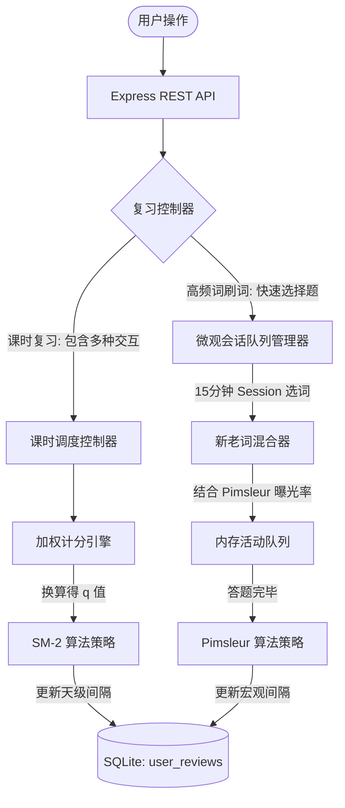

# 泰语学习系统——复习调度管理器后端设计方案 (Review Scheduling Manager V2)

本方案根据用户反馈进行了针对性升级，核心解决以下三种复习场景的差异化调度：
1. **课时单词复习（多交互加权得分 + SM-2）**：针对一节课（20~30词）中包含闪卡、造句、翻译等多种难以让用户直接评分的交互，通过加权计分模型，自动转换出 SM-2 的 $q$ 值。
2. **语法笔记复习**：与单词课时类似，通过练习加权评分机制来指导下一次的调度复习。
3. **高频词汇刷词（每天多次短时 Session + 混合新老词 Pimsleur 微观算法）**：针对 500 个高频词总体，支持短时间（如15分钟）快速选择题刷词。采用宏观与微观双层调度体系，利用 Pimsleur 的短间隔曝光逻辑实现新老词混合记忆。

---

## 1. 系统总体架构与设计模式

系统采用分层架构，并为高频词和课时词汇采用不同的适配器和微观控制器：

* **微观会话管理器 (In-session Session Queue Manager)**：用于高频词快速复习时，在内存中维护 15 分钟内的卡片队列，决定新词引入时机和老词的即时曝光（Pimsleur 秒级/步级间隔）。
* **宏观调度管理器 (Macro Spaced Repetition Scheduler)**：负责更新 SQLite 数据库中的 `next_review_at` 决策（天级别/小时级别）。
* **加权计分引擎 (Weighted Score Engine)**：收集前端提交的单词所有练习对错、提示使用率、答题耗时，产出最终复习得分并输送给 SM-2。



---

## 2. 数据库设计 (SQLite Schema)

我们需要对原本的表结构进行扩展，增加对高频词汇（独立于课时）以及多次 Session 的支持。

### 2.1 复习状态表 (`user_reviews`)
记录用户对每个学习对象（普通单词、高频词、语法）的个性化记忆参数。

```sql
CREATE TABLE IF NOT EXISTS user_reviews (
  id TEXT PRIMARY KEY,                       -- 唯一标识, 如 user123_vocab_vp008
  user_id TEXT NOT NULL,                     -- 用户ID
  item_type TEXT NOT NULL,                   -- 调度对象类型: 'vocab' | 'grammar' | 'high_freq'
  item_id TEXT NOT NULL,                     -- 调度对象的外键ID (如 vocabulary.id, grammar_notes.id, high_freq_words.id)
  scheduler_type TEXT NOT NULL,              -- 使用的调度算法: 'sm2' | 'pimsleur'
  
  -- 核心调度参数 --
  interval_minutes INTEGER DEFAULT 1440,     -- 下一次复习的时间间隔(分钟)
  repetitions INTEGER DEFAULT 0,             -- 连续成功复习的次数
  next_review_at TEXT NOT NULL,              -- 下一次建议复习时间 (UTC)
  last_reviewed_at TEXT,                     -- 上一次复习完成时间 (UTC)
  ease_factor REAL DEFAULT 2.5,              -- SM-2 专属: 简易度因子 (EF)
  
  created_at TEXT DEFAULT (datetime('now', 'utc')),
  updated_at TEXT DEFAULT (datetime('now', 'utc')),
  
  UNIQUE(user_id, item_type, item_id)
);

CREATE INDEX IF NOT EXISTS idx_user_reviews_due 
ON user_reviews(user_id, item_type, next_review_at);
```

### 2.2 Streak 与 Session 进度表 (`user_streak_stats`)
不仅支持传统的每日 Streak，还支持设置**单次 Session 最大时长 / 卡片数**，以实现灵活的每日多次 Streak。

```sql
CREATE TABLE IF NOT EXISTS user_streak_stats (
  user_id TEXT,
  session_type TEXT,                         -- Session类型: 'lesson_review' | 'high_freq_speed'
  current_streak_days INTEGER DEFAULT 0,     -- 当前连续天数
  max_streak_days INTEGER DEFAULT 0,         -- 历史最长连续天数
  last_streak_date TEXT,                     -- 上一次达成至少一次 Streak 的日期 ('YYYY-MM-DD')
  
  -- 每日进程控制 (支持一天多次 Streak) --
  session_target_count INTEGER DEFAULT 15,   -- 单次 Session 目标卡片数 (例如课时为 20-30个, 高频词为 15个)
  completed_streaks_today INTEGER DEFAULT 0, -- 今天已完成的 Session/Streak 数量
  current_session_completed INTEGER DEFAULT 0,-- 当前进行中的 Session 已复习卡片计数
  last_active_date TEXT,                     -- 上一次活跃日期 ('YYYY-MM-DD')
  
  PRIMARY KEY (user_id, session_type)
);
```

---

## 3. 核心算法设计与实现

### 3.1 课时单词与语法的“多交互加权评分模型”（转换为 SM-2 $q$ 值）

当用户复习一个普通单词或语法笔记时，前端需要完成一系列交互题目。加权计分引擎会在用户完成所有练习后对该词汇总评分，计算公式如下：

#### **计算公式**
每一个交互题目 $i$ 的得分 $S_i$：
* 一次答对：$S_i = 1.0$
* 答错 1 次后答对：$S_i = 0.6$
* 使用了提示才答对：$S_i = 0.5$
* 答错 $\ge 2$ 次：$S_i = 0.0$

整体项的分数 $S_{total}$（平均分）：
$$S_{total} = \frac{1}{N} \sum_{i=1}^{N} S_i$$

将 $S_{total} \in [0.0, 1.0]$ 线性映射为 SM-2 的质量等级 $q \in [0, 5]$：
$$q = \text{round}(S_{total} \times 5)$$

#### **映射关系对照表**
| 平均得分范围 $S_{total}$ | 转换后 $q$ | 对应记忆掌握程度 |
| :--- | :--- | :--- |
| $[0.90, 1.00]$ | **5** (Perfect) | 反应极快，完全正确 (极佳记忆) |
| $[0.75, 0.90)$ | **4** (Correct) | 稍有迟疑或使用了 1 次提示，但最终正确 (良好记忆) |
| $[0.55, 0.75)$ | **3** (Pass) | 答错 1 次，但经过修正后正确 (勉强记得) |
| $[0.35, 0.55)$ | **2** (Wrong-Easy)| 错题多，修正吃力，觉得答案显而易见但容易选错 (遗忘边缘) |
| $[0.15, 0.35)$ | **1** (Wrong-Hard)| 大量错误，近乎完全记不起来 (遗忘) |
| $[0.00, 0.15)$ | **0** (Blackout)  | 脑中完全没有这个概念 (彻底遗忘) |

#### **后端评分转换代码实现**
```javascript
// WeightedScoreEngine.js
export class WeightedScoreEngine {
  /**
   * 将前端返回的交互题答题日志转换为 SM-2 的 q 值
   * @param {Array} attempts - 交互日志, 格式为: [{ taskId: string, attemptsCount: number, hintsUsed: boolean, finalCorrect: boolean }]
   * @returns {number} 0-5 之间的整数 q
   */
  static calculateQualityRating(attempts) {
    if (!attempts || attempts.length === 0) return 3; // 默认中等
    
    let totalScore = 0;
    attempts.forEach(attempt => {
      if (!attempt.finalCorrect) {
        totalScore += 0.0;
      } else if (attempt.attemptsCount === 1 && !attempt.hintsUsed) {
        totalScore += 1.0; // 完美
      } else if (attempt.hintsUsed) {
        totalScore += 0.5; // 用了提示
      } else if (attempt.attemptsCount === 2) {
        totalScore += 0.6; // 错一次后对
      } else {
        totalScore += 0.0;
      }
    });

    const averageScore = totalScore / attempts.length;
    let q = Math.round(averageScore * 5);
    return Math.max(0, Math.min(5, q)); // 限制在 0-5 之间
  }
}
```

---

### 3.2 高频词汇“每天多次短时 Session”与 Pimsleur 混学微观队列

对于 500 个高频词，复习模式是**高频度、短耗时选择题（刷词）**。我们必须在微观（Session 内部答题流）上控制新词引入与老词的 Pimsleur 时间差曝光。

#### **微观会话队列机制 (In-Session Micro Queue)**
当用户开启一个 15 分钟的复习 Session 时：
1. **老词拉取**：从数据库中查询当前待复习（`next_review_at <= datetime('now')`）的高频词汇。
2. **混合新词**：如果待复习的词数不足 Session 目标数，或者根据比例（例如：80% 老词，20% 新词），向队列中引入从未学过的“新词”。
3. **会话内微观排程 (Pimsleur 梯度曝光)**：
   * **首次引入/答错**：将该词插入到当前已完成答题序号的 `+1`（立即重试）、`+3`（稍后重试）和 `+8`（Session 结束前确认）的位置。
   * **再次答对**：认为本次 Session 记忆成功，该词在此 Session 中不会再出现，并在 Session 结束时更新数据库中的宏观复习时间 `next_review_at`（应用 Pimsleur 天级渐进算法）。

```javascript
// HighFreqSessionManager.js
export class HighFreqSessionManager {
  constructor(userId, db) {
    this.userId = userId;
    this.db = db;
    this.activeQueue = []; // 当前内存中的答题队列 [ { word, stepIntervals: [] } ]
    this.currentIndex = 0;
  }

  /**
   * 初始化一个 15分钟 的刷词 Session 队列
   */
  async initializeSession(sessionTarget = 15) {
    // 1. 获取到期词
    const dueReviews = await this.db.all(
      `SELECT * FROM user_reviews 
       WHERE user_id = ? AND item_type = 'high_freq' AND next_review_at <= datetime('now', 'utc') 
       LIMIT ?`, 
      [this.userId, sessionTarget]
    );

    // 2. 补足新词
    let newWordsNeeded = sessionTarget - dueReviews.length;
    let newWords = [];
    if (newWordsNeeded > 0) {
      newWords = await this.db.all(
        `SELECT * FROM high_frequency_words 
         WHERE id NOT IN (SELECT item_id FROM user_reviews WHERE user_id = ? AND item_type = 'high_freq')
         LIMIT ?`,
        [this.userId, newWordsNeeded]
      );
    }

    // 3. 混合并构建微观队列
    this.activeQueue = [];
    // 放入老词（需复习）
    dueReviews.forEach(r => this.activeQueue.push({ item: r, type: 'old', correctInRow: 0 }));
    // 放入新词
    newWords.forEach(w => this.activeQueue.push({ item: w, type: 'new', correctInRow: 0 }));
    
    this.shuffle(this.activeQueue);
    this.currentIndex = 0;
    return this.getCurrentCard();
  }

  /**
   * 答题反馈处理 (微观级别控制)
   * @param {boolean} isCorrect - 用户选择题是否答对
   */
  handleAnswer(isCorrect) {
    const currentCard = this.activeQueue[this.currentIndex];
    
    if (isCorrect) {
      currentCard.correctInRow++;
      // Pimsleur 微观原则: 连续答对 2 次则在此 Session 中过关
      if (currentCard.correctInRow >= 2) {
        // 从当前位置往后的队列中移除该词的所有复制，代表本 Session 通过
        this.removeFromQueue(currentCard.item.id);
      } else {
        // 只答对 1 次，稍微隔开点再考一次 (比如隔 3 张卡片后)
        this.insertIntoQueue(currentCard, 3);
        this.currentIndex++;
      }
    } else {
      // 答错了，重置连续正确计数，立即在下一张或隔一张重新曝光
      currentCard.correctInRow = 0;
      this.insertIntoQueue(currentCard, 1); // 隔 1 张卡片重新出现
      this.currentIndex++;
    }

    return this.getCurrentCard();
  }

  insertIntoQueue(card, relativeStep) {
    const targetIndex = this.currentIndex + relativeStep + 1;
    // 浅复制卡片，确保内存引用独立但数据一致
    const cardCopy = { ...card };
    if (targetIndex >= this.activeQueue.length) {
      this.activeQueue.push(cardCopy);
    } else {
      this.activeQueue.splice(targetIndex, 0, cardCopy);
    }
  }

  removeFromQueue(itemId) {
    // 过滤掉后续队列中所有未答的相同 itemId
    this.activeQueue = this.activeQueue.filter((card, idx) => {
      if (idx <= this.currentIndex) return true;
      return card.item.id !== itemId;
    });
  }

  getCurrentCard() {
    if (this.currentIndex >= this.activeQueue.length) {
      return null; // Session 结束
    }
    return this.activeQueue[this.currentIndex];
  }
}
```

---

### 3.3 高频词前端会话流与 UI 交互设计 (High-Freq Session Front-end Interaction Flow)

为了提供极佳的学习体验，高频词刷词 Session 的前端界面（`appHighFreqWords.html`）进行了视觉体系和交互流的重构：

#### **3.3.1 单词复习的三段式交互流 (Three-Step Card Interaction)**
每个卡片在会话期间在前端被拆分为三步依次进行，建立“输入-反馈-检验”的学习闭环：
1. **第一步：语义复习 (Meaning & Examples Review)**
   * **词条点击发音**：主词条支持点击交互，通过挂载于全局的 `playAudioDirect(text)` 函数调用 API (`https://googleapi-w56agazoha-uc.a.run.app/?text=...`) 进行即时音频播放，并配有呼吸动效与 cursor 指针态。
   * **视觉卡片包裹**：核心释义与例句被统一包裹在一个浅灰色的圆角卡片中。例句采用醒目的深蓝色（`#1e3a8a`）和引号进行装饰，多条分立，突出例句显著性。
2. **第二步：例句翻译 (Example Translation - 桥接交互)**
   * **输入与反馈**：从语义复习点击“我知道了”后，若该词包含例句，进入翻译步骤。提供文本输入框供学生输入自己对例句的中文翻译。
   * **无缝回车 (Enter) 控制**：
     * **第一次按 ENTER**：提交翻译并锁死输入框，显示官方参考翻译。同时辅助操作按钮变为“开始测验 →”。
     * **第二次按 ENTER**：直接过桥进入下一步，无需鼠标点击，大幅提升连续刷词时的流畅度。
     * **查看参考辅助**：除主按钮外，提供线框形式的次级按钮“查看参考”，点击同样可跳过输入直接进入反馈页。
   * *注：对于没有例句的词条，前端将自动跳过此步骤直接进入第三步。*
3. **第三步：单选题测验 (Multiple Choice Quiz)**
   * **选项混淆打乱 (Option Shuffling)**：对于拉取到的四个释义干扰项，在前端渲染前使用随机排序算法对其重新打乱，打破之前“首选项必然正确”的规律，防止作弊和机械性记忆。
   * **反馈和状态提交**：用户点击选项后给出即时对错红绿颜色反馈，随后调用 `POST /api/reviews/session/submit` 将单题结果提交给 Pimsleur 引擎更新队列。

#### **3.3.2 界面视觉规范 (Light Mode Theme & Hierarchy)**
* **色系**：改用干净的亮色模式（Light Mode），以浅灰色（`#f8fafc`）作背景，深石板色（`#0f172a`）作为主文字颜色。
* **唯一强调色**：使用皇家蓝（`#2563eb`）作为主按钮、焦点边框和例句高亮的唯一强调色。
* **触控尺寸**：动作按钮高度不低于 `48px`，并使用圆角设计（`rounded-full`），提供极佳的触控手感。

---

## 4. RESTful API 接口设计与联动

为了完美匹配每日多次 Streak 刷词，设计以下两个端点：

### 4.1 `GET /api/reviews/session/start` (开启高频词/课时复习)
* **参数**：
  * `userId`: 用户ID
  * `type`: `'high_freq'`（高频词快速 Session） 或 `'lesson'`（普通课时复习）
* **后端行为**：
  * 如果是 `high_freq`，后端在内存（或 Session 缓存）中运行 `HighFreqSessionManager`，组装混合了新老词的 Pimsleur 微观队列，返回给前端第一批练习卡片（带四个备选干扰项的单选题）。

### 4.2 `POST /api/reviews/session/submit` (提交单卡片或整课的复习反馈)
* **Body 参数**：
  ```json
  {
    "userId": "user_001",
    "itemType": "vocab",          // 'vocab' | 'grammar' | 'high_freq'
    "itemId": "vp_008",
    "sessionType": "lesson_review", // 'lesson_review' | 'high_freq_speed'
    
    // 情况A: 课时复习，传多交互尝试日志进行加权评分
    "attempts": [
      { "taskId": "vp_008_task_1", "attemptsCount": 1, "hintsUsed": false, "finalCorrect": true },
      { "taskId": "vp_008_task_2", "attemptsCount": 2, "hintsUsed": false, "finalCorrect": true }
    ],
    
    // 情况B: 高频词刷词，单题即时对错
    "singleAttempt": {
      "correct": true
    }
  }
  ```
* **后端计算流程**：
  1. **课时复习分支**：
     * 解析 `attempts` 数组，经过 `WeightedScoreEngine` 计算出 $q$ 值。
     * 将 $q$ 输入 `SM2Strategy`，计算新的天级 `interval_minutes` 与 `next_review_at`。
     * 写入数据库 `user_reviews`。
  2. **高频词刷词分支**：
     * 高频词单题对错输入 `HighFreqSessionManager`。
     * 若该词在会话中成功通关（例如连续答对两次），触发宏观调度：调用 `PimsleurStrategy` 将其复习间隔翻倍（天级/小时级），并持久化到 `user_reviews`。
  3. **Streak 状态核算**：
     * 更新当前 Session 的进度 `current_session_completed`。
     * 若 `current_session_completed >= session_target_count`，重置该值并让用户今日的 Streak 数 `completed_streaks_today += 1`。如果是新的一天，检查昨天的 Streak 达标情况以维护 `current_streak_days`。
     * 返回结构：
       ```json
       {
         "success": true,
         "sessionCompleted": true,
         "streakStats": {
           "completedStreaksToday": 2,
           "currentStreakDays": 5,
           "sessionProgress": "15/15"
         }
       }
       ```

---

## 5. 方案总结

这一改进方案深度契合您的构想：
- **消除了传统背词软件中每个练习后让用户繁琐打分的痛点**：对于混合了多种练习形式的课时单词与语法，通过系统**后台加权计分**折算为 $q$ 值再应用 SM-2，保障了系统调度的科学性与用户交互的流畅度。
- **提供了碎片化学习的最优解**：对于高频词汇，将“宏观 Spaced Repetition（SQLite）”与“微观 Session Timed Queue（内存）”相结合。每次只需要 15 分钟（每次 15 个词左右），结合 Pimsleur 微观的“即刻错、即刻重考”机制，保证用户在高频词汇上的记忆高曝光度。
- **多次 Streak 机制**：让一天多次复习（如早起刷 15 个高频词，晚饭后复习 1 个课时）都能记录为累加的 Streak，帮助用户在极具弹性的时间计划中养成复习习惯。
