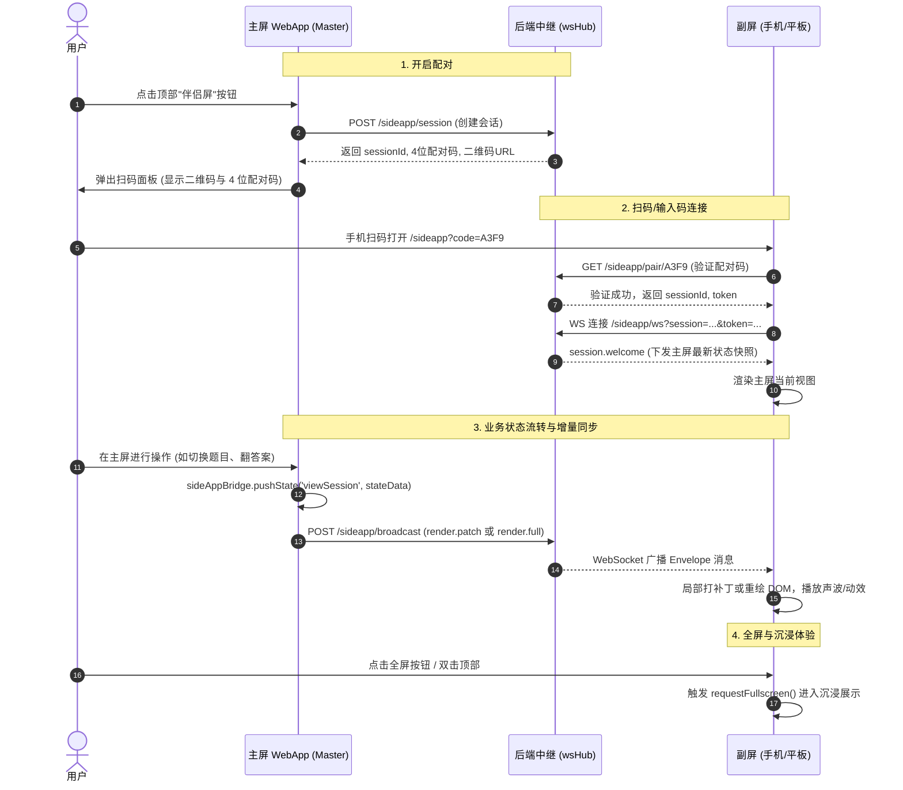

# SideApp 伴侣屏（第二屏幕）架构设计与改造接入指南

> **文档定位**：本指南是一份自包含的架构设计、通信协议规范与完整工程源码指南。任何 AI 或开发工程师均可根据本文档，在任意现有的 WebApp（主屏应用）与后端服务中，以**极低改造成本（通常 1~2 小时）**快速落地一套低延迟、免配置、支持局域网移动端/平板设备同步呈现的**伴侣屏（SideApp）能力**。

---

## 目录 (Table of Contents)

1. [架构概述与核心设计原则](#1-架构概述与核心设计原则)
2. [系统架构与时序图](#2-系统架构与时序图)
3. [目录规范与构件矩阵](#3-目录规范与构件矩阵)
4. [AI 改造执行四步法（步骤指南）](#4-ai-改造执行四步法步骤指南)
5. [通信协议规范 (Protocol v1.0)](#5-通信协议规范-protocol-v10)
6. [完整源码包 (Full Source Code)](#6-完整源码包-full-source-code)
   - 6.1 [后端：协议定义 protocol.js](#61-后端协议定义-protocoljs)
   - 6.2 [后端：会话管理 sessionStore.js](#62-后端会话管理-sessionstorejs)
   - 6.3 [后端：WebSocket Hub wsHub.js](#63-后端websocket-hub-wshubjs)
   - 6.4 [后端：模块入口与路由 index.js](#64-后端模块入口与路由-indexjs)
   - 6.5 [主屏端：状态桥接器 bridge.js](#65-主屏端状态桥接器-bridgejs)
   - 6.6 [主屏端：配对面板 pairingPanel.js](#66-主屏端配对面板-pairingpaneljs)
   - 6.7 [副屏端：外壳与全屏交互 index.html](#67-副屏端外壳与全屏交互-indexhtml)
   - 6.8 [副屏端：通信客户端 wsClient.js](#68-副屏端通信客户端-wsclientjs)
   - 6.9 [副屏端：视图渲染器模板 renderer.js](#69-副屏端视图渲染器模板-rendererjs)
7. [测试验证与验收清单](#7-测试验证与验收清单)
8. [直接发给 AI 的改造提示词模板](#8-直接发给-ai-的改造提示词模板)

---

## 1. 架构概述与核心设计原则

伴侣屏（SideApp）旨在将手机、iPad、平板电脑或外接扩展屏转化为**沉浸式的第二屏幕**，在教学、演讲提词、考卷答题、看板监视、音乐播放等场景中提供双屏联动。

整体设计遵循以下 **5 大核心原则**：

```
┌─────────────────┐       HTTP / WS       ┌─────────────────┐       WebSocket       ┌─────────────────┐
│  主屏 WebApp   │ ─────────────────────> │  后端中继服务   │ ─────────────────────> │  副屏 SideApp   │
│  (Master Control)│  Push State / Patch   │  (Relay & Hub)  │  Broadcast Envelope   │  (Passive Shell)│
└─────────────────┘                       └─────────────────┘                       └─────────────────┘
```

1. **单向无状态渲染 (Unidirectional Data Flow)**：副屏是“哑终端（Dumb Terminal）”，**不写数据库、不处理业务逻辑**，所有数据均由主屏单向推流，稳定性极高。
2. **零配置极简配对 (Zero-Config Pairing)**：基于局域网 IP 自动嗅探与 4 位免混淆字符配对码（例如 `A3F9`），支持手机原生相机直接扫码即连，无需注册或账号登录。
3. **JSON Patch 增量同步 (Incremental Diffing)**：主屏 Bridge 自动比对前后状态快照（Diff），仅当下发全新视图时发送全量（`render.full`），同视图更新时仅下发精准路径补丁（`render.patch`，如 `[{ path: "score", value: 98 }]`），网络开销几乎为零。
4. **自适应视口与全屏控制 (Fullscreen & Mobile Ready)**：副屏自带全屏切换能力，支持标准 Fullscreen API 及 iOS Safari 沉浸式视口（`100dvh`）降级，支持快捷键 <kbd>F</kbd>、顶部操作按钮与双击手势。
5. **健壮的断线自愈机制 (Liveness & Reconnection)**：包含 25 秒心跳保活（Ping/Pong）、指数退避断线重连（1s ➔ 15s），并在主屏关闭时向副屏发送友好告警。

---

## 2. 系统架构与时序图



---

## 3. 目录规范与构件矩阵

在任何项目中集成伴侣屏能力，推荐采用如下清晰解耦的目录划分：

```
your-project/
├── backend/ (或 server/)
│   └── sideapp/                 # 【100% 通用】后端中继服务
│       ├── index.js             # Express 路由注册与 WebSocket Upgrade 挂载
│       ├── protocol.js          # 协议信封定义、版本控制、JSON Patch 工具
│       ├── sessionStore.js      # 会话管理、4位配对码生成/TTL、客户端连接池
│       └── wsHub.js             # WebSocket 广播中枢与心跳检测
│
├── frontend-master/ (或 public/js/)
│   └── sideapp/                 # 【95% 通用】主屏中控 SDK
│       ├── bridge.js            # 主屏 Bridge：状态捕获、Diff 计算、推送中继
│       ├── pairingPanel.js      # 扫码配对弹窗 UI 组件
│       └── qrcode.min.js        # 二维码渲染库 (可用 CDN 或内嵌轻量库替代)
│
└── frontend-sideapp/ (或 public/sideapp/)
    └── sideapp/                 # 副屏独立单页
        ├── index.html           # 【90% 通用】外壳骨架、顶部状态栏、全屏切换按钮、Toast
        ├── wsClient.js          # 【100% 通用】WebSocket 客户端、心跳、断线重连
        └── renderer.js          # 【★ 唯一业务定制】根据 state 渲染业务 HTML 模板
```

### 构件复用度说明
- **后端 4 个文件**：**100% 通用**，零业务耦合，直接复制，通过 1 行代码挂载。
- **主屏 2 个文件**：**100% 通用**，引入即用。
- **副屏 index.html 与 wsClient.js**：**100% 通用**，直接提供现代深色玻璃质感、全屏控制与网络重连机制。
- **副屏 renderer.js**：**唯一需要编写业务代码的文件**，在此处编写您具体 App 的副屏界面。

---

## 4. AI 改造执行四步法（步骤指南）

若要指导 AI 或开发者对现有系统进行改造，请严格按以下步骤依次执行：

### Step 1: 后端接入（仅需 1 行代码挂载）
1. 确保安装依赖 `ws`（`npm install ws`）。
2. 将 `backend/sideapp/` 下的 4 个文件复制到后端项目中。
3. 在服务入口文件（如 `server.js` 或 `app.js`）中：
   ```javascript
   import { initSideApp } from './sideapp/index.js';

   // ... express 与 http.createServer 启动处 ...
   const server = http.createServer(app);
   initSideApp(app, server, PORT); // 自动挂载 /sideapp 路由及 ws 升级监听
   server.listen(PORT, () => ...);
   ```

### Step 2: 主屏 WebApp 引入 SDK 与按钮
1. 在主屏 HTML 的 `<head>` 或 `<body>` 末尾引入主屏脚本：
   ```html
   <script src="/js/sideapp/qrcode.min.js"></script>
   <script src="/js/sideapp/bridge.js"></script>
   <script src="/js/sideapp/pairingPanel.js"></script>
   ```
2. 在主屏顶部导航栏添加一个配对按钮胶囊：
   ```html
   <button id="btnSideAppPill" onclick="window.sideAppPairingPanel.show()" class="h-8 px-3 rounded-full border border-white/10 bg-white/5 hover:bg-white/10 flex items-center gap-1.5 text-xs text-slate-300 transition">
       <span id="sideAppStatusDot" class="w-2 h-2 rounded-full bg-slate-500"></span>
       <span id="sideAppStatusText">伴侣屏</span>
   </button>
   ```

### Step 3: 在主屏业务代码中推流（Push State）
只要主屏的数据发生变化，调用一次 `pushState` 即可：
```javascript
// 示例：切换为正在答题视图
window.sideAppBridge.pushState('viewExam', {
    questionIndex: 3,
    totalQuestions: 10,
    questionText: '下列关于光合作用说法正确的是？',
    options: ['A...', 'B...', 'C...', 'D...'],
    timeLeft: 45
});

// 示例：触发副屏声波/动效
window.sideAppBridge.playEffect('audio-playing', 'speaker', 2000);
```
> **提示**：不需要担心频繁调用！`bridge.js` 内部会自动进行深层比对（Deep Diff），如果数据没有改变，不会产生任何网络流量；如果只是局部字段改变（如 `timeLeft: 44`），仅传输微量 JSON Patch。

### Step 4: 编写副屏业务渲染层 (`renderer.js`)
在 `renderer.js` 中，根据 `this.currentView` 编写对应的 HTML 模板：
```javascript
mountCurrentView() {
    const s = this.localState || {};
    switch (this.currentView) {
        case 'viewExam':
            this.containerEl.innerHTML = `
                <div class="glass-panel p-6 rounded-3xl space-y-4">
                    <div class="text-xs text-violet-400">第 ${s.questionIndex} / ${s.totalQuestions} 题</div>
                    <h2 class="text-xl font-bold text-white">${s.questionText}</h2>
                </div>
            `;
            break;
    }
}
```

---

## 5. 通信协议规范 (Protocol v1.0)

所有通过 HTTP 广播和 WebSocket 推送的消息均包裹在标准信封（Envelope）中：

### 5.1 基础信封格式 (Envelope)
```json
{
  "seq": 102,
  "type": "render.patch",
  "protocolVersion": "1.0",
  "timestamp": 1740000000000,
  "payload": {
    "ops": [
      { "path": "timeLeft", "value": 44 }
    ]
  }
}
```

### 5.2 核心消息类型说明
| Type 标识 | 触发时机 | Payload 说明 |
| :--- | :--- | :--- |
| `session.welcome` | 副屏刚连接 WS 握手成功时 | `{ sessionId, view, state, meta }`，让副屏立即同步主屏当前最新快照 |
| `render.full` | 主屏视图切换（如从列表切换到答题） | `{ view: "viewExam", state: { ... } }` |
| `render.patch` | 主屏同一视图下的数据局部变动 | `{ ops: [ { path: "user.score", value: 100 } ] }` |
| `render.navigate`| 纯视图路由切换 | `{ view: "viewSummary" }` |
| `render.effect`  | 触发副屏视觉动效 | `{ name: "audio-playing", duration: 1500 }` |
| `ping` / `pong`  | 每 25 秒保活探测 | `{ timestamp: 1740000000000 }` |
| `session.error`  | 主屏关闭或鉴权失败 | `{ code: "MASTER_CLOSED", message: "..." }` |

---

## 6. 完整源码包 (Full Source Code)

以下提供生产就绪、无外部多余依赖的完整源码，可直接复制落地。

### 6.1 后端：协议定义 `protocol.js`
文件路径：`backend/sideapp/protocol.js`
```javascript
/**
 * SideApp Communication Protocol Constants & Utilities
 * Specification: SideApp Protocol v1.0
 */

export const PROTOCOL_VERSION = '1.0';

export const MESSAGE_TYPES = {
  WELCOME: 'session.welcome',
  RENDER_FULL: 'render.full',
  RENDER_PATCH: 'render.patch',
  RENDER_NAVIGATE: 'render.navigate',
  RENDER_EFFECT: 'render.effect',
  PING: 'ping',
  PONG: 'pong',
  ERROR: 'session.error'
};

export const ERROR_CODES = {
  MASTER_CLOSED: 'MASTER_CLOSED',
  AUTH_FAILED: 'AUTH_FAILED',
  SESSION_EXPIRED: 'SESSION_EXPIRED',
  INVALID_PROTOCOL: 'INVALID_PROTOCOL',
  INVALID_PAYLOAD: 'INVALID_PAYLOAD'
};

export function createEnvelope(type, payload = {}, seq = 0) {
  return {
    seq: Number(seq) || 0,
    type,
    protocolVersion: PROTOCOL_VERSION,
    timestamp: Date.now(),
    payload: payload || {}
  };
}

export function validateEnvelope(envelope) {
  if (!envelope || typeof envelope !== 'object') {
    return { valid: false, error: 'Envelope must be an object' };
  }
  if (typeof envelope.type !== 'string' || !envelope.type) {
    return { valid: false, error: 'Missing or invalid "type"' };
  }
  const incomingVer = envelope.protocolVersion ? String(envelope.protocolVersion).split('.')[0] : '';
  const currentMajor = PROTOCOL_VERSION.split('.')[0];
  if (incomingVer && incomingVer !== currentMajor) {
    return { valid: false, error: `Incompatible protocol version: ${envelope.protocolVersion}` };
  }
  return { valid: true };
}

export function computePatch(prev, next, prefix = '') {
  const ops = [];
  if (prev === next) return ops;
  if (
    prev === null || prev === undefined ||
    next === null || next === undefined ||
    typeof prev !== 'object' || typeof next !== 'object'
  ) {
    ops.push({ path: prefix, value: next });
    return ops;
  }
  if (Array.isArray(prev) || Array.isArray(next)) {
    if (!Array.isArray(prev) || !Array.isArray(next) || prev.length !== next.length) {
      ops.push({ path: prefix, value: next });
      return ops;
    }
    let arrayChanged = false;
    for (let i = 0; i < prev.length; i++) {
      const itemOps = computePatch(prev[i], next[i], `${prefix}[${i}]`);
      if (itemOps.length > 0) {
        arrayChanged = true;
        break;
      }
    }
    if (arrayChanged) ops.push({ path: prefix, value: next });
    return ops;
  }
  const prevKeys = Object.keys(prev);
  const nextKeys = Object.keys(next);
  const allKeys = new Set([...prevKeys, ...nextKeys]);
  for (const key of allKeys) {
    const keyPath = prefix ? `${prefix}.${key}` : key;
    if (!(key in next)) {
      ops.push({ path: keyPath, value: undefined });
    } else if (!(key in prev)) {
      ops.push({ path: keyPath, value: next[key] });
    } else {
      const nestedOps = computePatch(prev[key], next[key], keyPath);
      ops.push(...nestedOps);
    }
  }
  return ops;
}

export function setByPath(target, path, value) {
  if (!path || !target) return target;
  const segments = String(path)
    .replace(/\[(\w+)\]/g, '.$1')
    .replace(/^\./, '')
    .split('.')
    .filter(Boolean);
  let curr = target;
  for (let i = 0; i < segments.length - 1; i++) {
    const seg = segments[i];
    const nextSeg = segments[i + 1];
    if (curr[seg] === null || curr[seg] === undefined || typeof curr[seg] !== 'object') {
      curr[seg] = /^\d+$/.test(nextSeg) ? [] : {};
    }
    curr = curr[seg];
  }
  const lastSeg = segments[segments.length - 1];
  if (value === undefined) {
    if (Array.isArray(curr) && /^\d+$/.test(lastSeg)) {
      curr.splice(Number(lastSeg), 1);
    } else {
      delete curr[lastSeg];
    }
  } else {
    curr[lastSeg] = value;
  }
  return target;
}
```

---

### 6.2 后端：会话管理 `sessionStore.js`
文件路径：`backend/sideapp/sessionStore.js`
```javascript
import crypto from 'crypto';

const CODE_CHARACTERS = '23456789ABCDEFGHJKLMNPQRSTUVWXYZ'; // 32字符，去除0/O/1/I等歧义符

function generatePairingCode(length = 4) {
  const bytes = crypto.randomBytes(length);
  let code = '';
  for (let i = 0; i < length; i++) {
    code += CODE_CHARACTERS[bytes[i] % CODE_CHARACTERS.length];
  }
  return code;
}

export class SessionStore {
  constructor() {
    this.sessions = new Map();
    this.codeToSessionMap = new Map();
    this.cleanupTimer = setInterval(() => this.cleanExpiredSessions(), 5 * 60 * 1000);
    if (this.cleanupTimer.unref) this.cleanupTimer.unref();
  }

  createSession({ deviceName = 'Master', ttlMs = 2 * 60 * 60 * 1000 } = {}) {
    const sessionId = `sess_${Date.now()}_${crypto.randomBytes(4).toString('hex')}`;
    const masterToken = `tok_${crypto.randomBytes(16).toString('hex')}`;
    let pairingCode = '';
    let attempts = 0;
    do {
      pairingCode = generatePairingCode(4);
      attempts++;
    } while (this.codeToSessionMap.has(pairingCode) && attempts < 20);

    const now = Date.now();
    const session = {
      sessionId,
      pairingCode,
      masterToken,
      deviceName,
      createdAt: now,
      expiresAt: now + ttlMs,
      state: 'active',
      lastSnapshot: { view: 'default', state: {} },
      validTokens: new Set([masterToken]),
      connectedClients: new Map()
    };

    this.sessions.set(sessionId, session);
    this.codeToSessionMap.set(pairingCode, sessionId);

    return { sessionId, pairingCode, token: masterToken, expiresAt: session.expiresAt };
  }

  getSession(sessionId) {
    const s = this.sessions.get(sessionId);
    if (!s || s.state === 'closed' || s.expiresAt < Date.now()) return null;
    return s;
  }

  getSessionByCode(code) {
    if (!code) return null;
    const sessionId = this.codeToSessionMap.get(code.toUpperCase().trim());
    return sessionId ? this.getSession(sessionId) : null;
  }

  generateClientToken(sessionId) {
    const session = this.getSession(sessionId);
    if (!session) return null;
    const clientToken = `tok_${crypto.randomBytes(16).toString('hex')}`;
    session.validTokens.add(clientToken);
    return clientToken;
  }

  validateToken(sessionId, token) {
    const session = this.getSession(sessionId);
    return session ? session.validTokens.has(token) : false;
  }

  saveSnapshot(sessionId, snapshot) {
    const session = this.getSession(sessionId);
    if (session) session.lastSnapshot = snapshot;
  }

  addClient(sessionId, clientId, clientMeta = {}) {
    const session = this.getSession(sessionId);
    if (!session) return;
    session.connectedClients.set(clientId, {
      ...clientMeta,
      connectedAt: Date.now(),
      lastSeen: Date.now()
    });
  }

  removeClient(sessionId, clientId) {
    const session = this.sessions.get(sessionId);
    if (session) session.connectedClients.delete(clientId);
  }

  closeSession(sessionId) {
    const session = this.sessions.get(sessionId);
    if (session) {
      session.state = 'closed';
      this.codeToSessionMap.delete(session.pairingCode);
      this.sessions.delete(sessionId);
    }
  }

  cleanExpiredSessions() {
    const now = Date.now();
    for (const [id, s] of this.sessions.entries()) {
      if (s.expiresAt < now || s.state === 'closed') {
        this.codeToSessionMap.delete(s.pairingCode);
        this.sessions.delete(id);
      }
    }
  }
}

export const sessionStore = new SessionStore();
```

---

### 6.3 后端：WebSocket Hub `wsHub.js`
文件路径：`backend/sideapp/wsHub.js`
```javascript
import { WebSocketServer, WebSocket } from 'ws';
import { parse as parseUrl } from 'url';
import { MESSAGE_TYPES, ERROR_CODES, createEnvelope, setByPath } from './protocol.js';
import { sessionStore } from './sessionStore.js';

export class WsHub {
  constructor() {
    this.wss = new WebSocketServer({ noServer: true });
    this.sessionSockets = new Map();
    this.sessionSeq = new Map();

    this.wss.on('connection', (ws, req, authData) => this.handleConnection(ws, req, authData));
    this.heartbeatInterval = setInterval(() => this.checkHeartbeats(), 25000);
    if (this.heartbeatInterval.unref) this.heartbeatInterval.unref();
  }

  nextSeq(sessionId) {
    const current = this.sessionSeq.get(sessionId) || 0;
    const next = current + 1;
    this.sessionSeq.set(sessionId, next);
    return next;
  }

  handleUpgrade(request, socket, head) {
    const parsed = parseUrl(request.url, true);
    if (parsed.pathname !== '/sideapp/ws') return false;

    const sessionId = parsed.query.session || parsed.query.sessionId;
    const token = parsed.query.token;

    if (!sessionId || !token || !sessionStore.validateToken(sessionId, token)) {
      socket.write('HTTP/1.1 401 Unauthorized\r\nConnection: close\r\n\r\n');
      socket.destroy();
      return true;
    }

    this.wss.handleUpgrade(request, socket, head, (ws) => {
      this.wss.emit('connection', ws, request, { sessionId, token });
    });
    return true;
  }

  handleConnection(ws, req, { sessionId }) {
    const clientId = `client_${Date.now()}_${Math.random().toString(36).substring(2, 8)}`;
    ws.sessionId = sessionId;
    ws.clientId = clientId;
    ws.isAlive = true;

    if (!this.sessionSockets.has(sessionId)) {
      this.sessionSockets.set(sessionId, new Set());
    }
    this.sessionSockets.get(sessionId).add(ws);
    sessionStore.addClient(sessionId, clientId, {
      ip: req.headers['x-forwarded-for'] || req.socket.remoteAddress,
      userAgent: req.headers['user-agent']
    });

    ws.on('pong', () => { ws.isAlive = true; });
    ws.on('message', (data) => {
      try {
        const msg = JSON.parse(data.toString());
        if (msg.type === 'ping') {
          ws.send(JSON.stringify(createEnvelope(MESSAGE_TYPES.PONG, {}, this.nextSeq(sessionId))));
        }
      } catch (e) {}
    });

    ws.on('close', () => {
      const set = this.sessionSockets.get(sessionId);
      if (set) {
        set.delete(ws);
        if (set.size === 0) this.sessionSockets.delete(sessionId);
      }
      sessionStore.removeClient(sessionId, clientId);
    });

    // 握手成功：下发欢迎信封及主屏最新状态
    const session = sessionStore.getSession(sessionId);
    const welcomePayload = {
      sessionId,
      clientId,
      view: session?.lastSnapshot?.view || 'default',
      state: session?.lastSnapshot?.state || {}
    };
    ws.send(JSON.stringify(createEnvelope(MESSAGE_TYPES.WELCOME, welcomePayload, this.nextSeq(sessionId))));
  }

  broadcast(sessionId, message) {
    const sockets = this.sessionSockets.get(sessionId);
    if (!sockets || sockets.size === 0) return 0;
    const envelope = createEnvelope(message.type, message.payload, this.nextSeq(sessionId));
    const raw = JSON.stringify(envelope);

    let sent = 0;
    for (const ws of sockets) {
      if (ws.readyState === WebSocket.OPEN) {
        ws.send(raw);
        sent++;
      }
    }
    return sent;
  }

  closeSession(sessionId) {
    const sockets = this.sessionSockets.get(sessionId);
    if (sockets) {
      const err = createEnvelope(MESSAGE_TYPES.ERROR, {
        code: ERROR_CODES.MASTER_CLOSED,
        message: '主屏幕已断开连接'
      });
      for (const ws of sockets) {
        if (ws.readyState === WebSocket.OPEN) ws.send(JSON.stringify(err));
        ws.close(1000, 'Master session closed');
      }
      this.sessionSockets.delete(sessionId);
    }
    this.sessionSeq.delete(sessionId);
  }

  checkHeartbeats() {
    for (const [sessionId, sockets] of this.sessionSockets.entries()) {
      for (const ws of sockets) {
        if (!ws.isAlive) {
          ws.terminate();
          sockets.delete(ws);
        } else {
          ws.isAlive = false;
          ws.ping();
        }
      }
    }
  }
}

export const wsHub = new WsHub();
```

---

### 6.4 后端：模块入口与路由 `index.js`
文件路径：`backend/sideapp/index.js`
```javascript
import express from 'express';
import os from 'os';
import path from 'path';
import { fileURLToPath } from 'url';
import { sessionStore } from './sessionStore.js';
import { wsHub } from './wsHub.js';
import { setByPath } from './protocol.js';

const __dirname = path.dirname(fileURLToPath(import.meta.url));

export function getLocalIpAddress() {
  const interfaces = os.networkInterfaces();
  const candidates = [];
  for (const [name, addrs] of Object.entries(interfaces)) {
    if (!addrs || /^(lo|docker|veth|br-)/i.test(name)) continue;
    for (const addr of addrs) {
      if (addr.family === 'IPv4' && !addr.internal) {
        candidates.push({ ip: addr.address, priority: /^(wlan|en|eth)/i.test(name) ? 1 : 2 });
      }
    }
  }
  candidates.sort((a, b) => a.priority - b.priority);
  return candidates.length > 0 ? candidates[0].ip : '127.0.0.1';
}

export function createSideAppRouter(port = 3000, staticPath = null) {
  const router = express.Router();

  // 1. 创建会话 (主屏调用)
  router.post('/sideapp/session', (req, res) => {
    const session = sessionStore.createSession({ deviceName: req.body?.deviceName || 'Master' });
    const localIp = getLocalIpAddress();
    res.json({
      sessionId: session.sessionId,
      pairingCode: session.pairingCode,
      wsUrl: `ws://${localIp}:${port}/sideapp/ws`,
      sideAppUrl: `http://${localIp}:${port}/sideapp?code=${session.pairingCode}`,
      localIp,
      port
    });
  });

  // 2. 验证配对码 (副屏扫码或输入码调用)
  router.get('/sideapp/pair/:code', (req, res) => {
    const session = sessionStore.getSessionByCode(req.params.code);
    if (!session) return res.status(404).json({ error: '配对码无效或已过期' });
    const token = sessionStore.generateClientToken(session.sessionId);
    res.json({ sessionId: session.sessionId, token, deviceName: session.deviceName });
  });

  // 3. 广播数据 (主屏推流)
  router.post('/sideapp/broadcast', express.json(), (req, res) => {
    const { sessionId, message } = req.body || {};
    const session = sessionStore.getSession(sessionId);
    if (!session) return res.status(404).json({ error: '会话不存在或已关闭' });

    // 同步内存中的快照，供后续新加入的设备直接获取
    if (message.type === 'render.full') {
      sessionStore.saveSnapshot(sessionId, { view: message.payload.view, state: message.payload.state });
    } else if (message.type === 'render.patch' && Array.isArray(message.payload?.ops)) {
      const snap = session.lastSnapshot || { view: 'default', state: {} };
      for (const op of message.payload.ops) setByPath(snap.state, op.path, op.value);
      sessionStore.saveSnapshot(sessionId, snap);
    }

    const clientCount = wsHub.broadcast(sessionId, message);
    res.json({ success: true, clientCount });
  });

  // 4. 关闭会话
  router.post('/sideapp/session/:sessionId/close', (req, res) => {
    wsHub.closeSession(req.params.sessionId);
    sessionStore.closeSession(req.params.sessionId);
    res.json({ success: true });
  });

  // 5. 托管副屏静态页面
  const resolvedStaticPath = staticPath || path.resolve(__dirname, '../../public/sideapp');
  router.use('/sideapp', express.static(resolvedStaticPath));
  router.get('/sideapp', (req, res) => {
    res.sendFile(path.join(resolvedStaticPath, 'index.html'));
  });

  return router;
}

export function initSideApp(app, httpServer, port = 3000, staticPath = null) {
  app.use(createSideAppRouter(port, staticPath));
  if (httpServer) {
    httpServer.on('upgrade', (req, socket, head) => {
      wsHub.handleUpgrade(req, socket, head);
    });
  }
  console.log(`[SideApp] 伴侣屏服务已挂载 (Port: ${port})`);
}
```

---

### 6.5 主屏端：状态桥接器 `bridge.js`
文件路径：`public/js/sideapp/bridge.js`
```javascript
(function (window) {
  function computePatch(prev, next, prefix = '') {
    const ops = [];
    if (prev === next) return ops;
    if (
      prev === null || prev === undefined ||
      next === null || next === undefined ||
      typeof prev !== 'object' || typeof next !== 'object'
    ) {
      ops.push({ path: prefix, value: next });
      return ops;
    }
    if (Array.isArray(prev) || Array.isArray(next)) {
      if (!Array.isArray(prev) || !Array.isArray(next) || prev.length !== next.length) {
        ops.push({ path: prefix, value: next });
        return ops;
      }
      let changed = false;
      for (let i = 0; i < prev.length; i++) {
        if (computePatch(prev[i], next[i], `${prefix}[${i}]`).length > 0) {
          changed = true;
          break;
        }
      }
      if (changed) ops.push({ path: prefix, value: next });
      return ops;
    }
    const prevKeys = Object.keys(prev);
    const nextKeys = Object.keys(next);
    const allKeys = new Set([...prevKeys, ...nextKeys]);
    for (const key of allKeys) {
      const keyPath = prefix ? `${prefix}.${key}` : key;
      if (!(key in next)) ops.push({ path: keyPath, value: undefined });
      else if (!(key in prev)) ops.push({ path: keyPath, value: next[key] });
      else ops.push(...computePatch(prev[key], next[key], keyPath));
    }
    return ops;
  }

  class SideAppBridge {
    constructor() {
      this.enabled = localStorage.getItem('sideapp_enabled') === 'true';
      this.sessionId = null;
      this.pairingCode = null;
      this.sideAppUrl = null;
      this.lastSnapshot = null;
      this.clientCount = 0;
      this.statusListeners = new Set();
    }

    async setEnabled(val) {
      this.enabled = Boolean(val);
      localStorage.setItem('sideapp_enabled', this.enabled ? 'true' : 'false');
      if (this.enabled && !this.sessionId) await this.start();
      else if (!this.enabled) await this.stop();
      this.notifyListeners();
    }

    async start() {
      try {
        const res = await fetch('/sideapp/session', {
          method: 'POST',
          headers: { 'Content-Type': 'application/json' },
          body: JSON.stringify({ deviceName: 'Master WebApp' })
        });
        if (!res.ok) throw new Error('Start session failed');
        const data = await res.json();
        this.sessionId = data.sessionId;
        this.pairingCode = data.pairingCode;
        this.sideAppUrl = data.sideAppUrl;
        this.notifyListeners();
        if (this.lastSnapshot) {
          this.pushState(this.lastSnapshot.view, this.lastSnapshot.state, true);
        }
        return data;
      } catch (e) {
        console.warn('[SideApp Bridge] Session start error:', e);
      }
    }

    pushState(view, state, forceFull = false) {
      if (!this.enabled || !this.sessionId) {
        this.lastSnapshot = { view, state: JSON.parse(JSON.stringify(state || {})) };
        return;
      }
      const prev = this.lastSnapshot;
      const isNewView = !prev || prev.view !== view || forceFull;

      if (isNewView) {
        this.lastSnapshot = { view, state: JSON.parse(JSON.stringify(state || {})) };
        this.sendBroadcast('render.full', { view, state });
      } else {
        const ops = computePatch(prev.state, state);
        if (ops.length > 0) {
          this.lastSnapshot.state = JSON.parse(JSON.stringify(state || {}));
          this.sendBroadcast('render.patch', { ops });
        }
      }
    }

    playEffect(name, target = '', duration = 1500) {
      if (!this.enabled || !this.sessionId) return;
      this.sendBroadcast('render.effect', { name, target, duration });
    }

    async sendBroadcast(type, payload) {
      try {
        await fetch('/sideapp/broadcast', {
          method: 'POST',
          headers: { 'Content-Type': 'application/json' },
          body: JSON.stringify({ sessionId: this.sessionId, message: { type, payload } })
        });
      } catch (e) {}
    }

    async stop() {
      if (!this.sessionId) return;
      try {
        await fetch(`/sideapp/session/${this.sessionId}/close`, { method: 'POST' });
      } catch (e) {}
      this.sessionId = null;
      this.pairingCode = null;
      this.notifyListeners();
    }

    onStatusChange(fn) {
      this.statusListeners.add(fn);
      fn(this.getStatus());
      return () => this.statusListeners.delete(fn);
    }

    getStatus() {
      return {
        enabled: this.enabled,
        sessionId: this.sessionId,
        pairingCode: this.pairingCode,
        sideAppUrl: this.sideAppUrl,
        clientCount: this.clientCount
      };
    }

    notifyListeners() {
      const s = this.getStatus();
      for (const fn of this.statusListeners) fn(s);
    }
  }

  window.sideAppBridge = new SideAppBridge();
})(window);
```

---

### 6.6 主屏端：配对面板 `pairingPanel.js`
文件路径：`public/js/sideapp/pairingPanel.js`
```javascript
(function (window) {
  class SideAppPairingPanel {
    constructor() {
      if (document.readyState === 'loading') {
        document.addEventListener('DOMContentLoaded', () => this.init());
      } else {
        this.init();
      }
    }

    init() {
      this.renderModal();
      window.sideAppBridge.onStatusChange((status) => {
        this.updateBadge(status);
        this.updateModal(status);
      });
      if (window.sideAppBridge.enabled) window.sideAppBridge.start();
    }

    updateBadge(status) {
      const dot = document.getElementById('sideAppStatusDot');
      const text = document.getElementById('sideAppStatusText');
      if (!dot || !text) return;

      if (!status.enabled) {
        dot.className = 'w-2 h-2 rounded-full bg-slate-500';
        text.innerText = '伴侣屏';
      } else if (status.pairingCode) {
        dot.className = 'w-2 h-2 rounded-full bg-emerald-400 animate-pulse';
        text.innerText = `伴侣屏 [${status.pairingCode}]`;
      }
    }

    show() {
      const modal = document.getElementById('modalSideAppPairing');
      if (modal) modal.classList.remove('hidden');
    }

    close() {
      const modal = document.getElementById('modalSideAppPairing');
      if (modal) modal.classList.add('hidden');
    }

    renderModal() {
      if (document.getElementById('modalSideAppPairing')) return;
      const html = `
        <div id="modalSideAppPairing" class="fixed inset-0 z-50 flex items-center justify-center p-4 bg-black/75 backdrop-blur-md hidden">
          <div class="bg-slate-900 border border-white/10 w-full max-w-sm rounded-3xl p-6 text-center space-y-5 text-white shadow-2xl">
            <div class="flex justify-between items-center">
              <h3 class="font-bold text-base">连结移动端伴侣屏</h3>
              <button onclick="window.sideAppPairingPanel.close()" class="text-slate-400 hover:text-white">&times;</button>
            </div>
            
            <div id="sideAppQrContainer" class="p-3 bg-white rounded-2xl inline-block mx-auto min-w-[140px] min-h-[140px]">
              <div id="sideAppQrCode"></div>
            </div>

            <div class="space-y-1">
              <div class="text-xs text-slate-400">或在手机端输入配对码</div>
              <div id="sideAppPairCodeText" class="text-3xl font-black font-mono tracking-widest text-violet-400">----</div>
            </div>

            <div class="text-xs text-slate-400">
              用手机/平板相机直接扫描上方二维码即可同步呈现
            </div>
          </div>
        </div>
      `;
      document.body.insertAdjacentHTML('beforeend', html);
    }

    updateModal(status) {
      const codeEl = document.getElementById('sideAppPairCodeText');
      const qrEl = document.getElementById('sideAppQrCode');
      if (codeEl) codeEl.innerText = status.pairingCode || '----';

      if (qrEl && status.sideAppUrl) {
        qrEl.innerHTML = '';
        if (typeof QRCode !== 'undefined') {
          new QRCode(qrEl, { text: status.sideAppUrl, width: 140, height: 140 });
        } else {
          // CDN / 图片降级方案
          qrEl.innerHTML = ``;
        }
      }
    }
  }

  window.sideAppPairingPanel = new SideAppPairingPanel();
})(window);
```

---

### 6.7 副屏端：外壳与全屏交互 `index.html`
文件路径：`public/sideapp/index.html`
```html
<!DOCTYPE html>
<html lang="zh-CN">
<head>
    <meta charset="UTF-8">
    <meta name="viewport" content="width=device-width, initial-scale=1.0, maximum-scale=1.0, user-scalable=no, viewport-fit=cover">
    <title>SideApp 伴侣屏</title>
    <script src="https://cdn.tailwindcss.com"></script>
    <script src="https://unpkg.com/@phosphor-icons/web"></script>
    <style>
        :root {
            --bg-gradient: radial-gradient(circle at 50% 0%, #17112c 0%, #0c0a17 60%, #07060d 100%);
        }
        body {
            background: var(--bg-gradient);
            color: #f8fafc;
            min-height: 100vh;
            min-height: -webkit-fill-available;
            padding-top: env(safe-area-inset-top, 0px);
            padding-bottom: env(safe-area-inset-bottom, 0px);
        }
        /* 全屏平滑色彩过渡 */
        html:fullscreen, body:fullscreen, html:-webkit-full-screen, body:-webkit-full-screen {
            background: var(--bg-gradient);
        }
        body.sideapp-pseudo-fullscreen {
            position: fixed;
            inset: 0;
            width: 100vw;
            height: 100dvh;
            z-index: 50;
            overflow-y: auto;
        }
        .glass-panel {
            background: rgba(26, 22, 48, 0.65);
            border: 1px solid rgba(255, 255, 255, 0.08);
            backdrop-filter: blur(20px);
        }
    </style>
</head>
<body class="flex flex-col justify-between selection:bg-violet-500 selection:text-white">

    <!-- 顶部状态栏与全屏按钮 -->
    <header class="w-full max-w-lg mx-auto px-4 py-3 flex items-center justify-between border-b border-white/10 shrink-0 select-none">
        <div class="flex items-center gap-2">
            <div class="h-8 w-8 rounded-xl bg-gradient-to-tr from-violet-600 to-fuchsia-600 flex items-center justify-center font-bold text-white text-sm">
                S
            </div>
            <div>
                <h1 class="text-sm font-bold text-white">SideApp 伴侣屏</h1>
                <p class="text-[10px] text-slate-400">第二屏幕 · 被动呈现</p>
            </div>
        </div>

        <div class="flex items-center gap-2">
            <div class="h-7 px-2.5 rounded-full bg-white/5 border border-white/10 flex items-center gap-1.5 text-xs text-slate-300">
                <span id="sideAppHeaderDot" class="w-2 h-2 rounded-full bg-slate-500"></span>
                <span id="sideAppHeaderText" class="text-[11px]">连接中...</span>
            </div>

            <!-- 全屏切换按钮 -->
            <button id="sideAppFullscreenBtn" onclick="toggleSideAppFullscreen()" title="切换全屏 (F)" class="h-7 w-7 rounded-lg bg-white/5 hover:bg-white/10 border border-white/10 flex items-center justify-center text-slate-400 hover:text-white transition">
                <i id="sideAppFullscreenIcon" class="ph-bold ph-arrows-out text-xs"></i>
            </button>

            <!-- 重新配对按钮 -->
            <button onclick="window.sideAppWsClient.showPairingInputScreen()" title="重新输入配对码" class="h-7 w-7 rounded-lg bg-white/5 hover:bg-white/10 border border-white/10 flex items-center justify-center text-slate-400 hover:text-white transition">
                <i class="ph-bold ph-key text-xs"></i>
            </button>
        </div>
    </header>

    <!-- 动态 Toast 提示 -->
    <div id="sideAppToast" class="fixed bottom-6 left-1/2 -translate-x-1/2 z-50 px-4 py-2 rounded-full bg-slate-900/90 text-white text-xs font-medium shadow-xl backdrop-blur-md pointer-events-none transition-all duration-300 opacity-0 translate-y-2 border border-white/10 flex items-center gap-2">
        <i id="sideAppToastIcon" class="ph-bold ph-arrows-out text-violet-400"></i>
        <span id="sideAppToastText"></span>
    </div>

    <!-- 动态视图挂载根节点 -->
    <main class="flex-1 w-full max-w-lg mx-auto p-4 flex flex-col justify-center" id="sideAppRoot">
        <div class="glass-panel rounded-3xl p-6 text-center space-y-2">
            <div class="text-violet-400 font-bold">正在同步操作台...</div>
            <div class="text-xs text-slate-400">请确保主屏幕已打开并开启了伴侣屏特性</div>
        </div>
    </main>

    <!-- 页脚与快捷全屏 -->
    <footer class="w-full max-w-lg mx-auto px-4 py-2.5 text-center text-[10px] text-slate-500 shrink-0 flex items-center justify-center gap-2">
        <span>SideApp 哑终端渲染器</span>
        <span>·</span>
        <button onclick="toggleSideAppFullscreen()" class="hover:text-slate-300 transition underline">切换全屏</button>
    </footer>

    <!-- 配对码输入弹窗 -->
    <div id="sideAppPairingCodeModal" class="fixed inset-0 z-50 flex items-center justify-center p-4 bg-black/80 backdrop-blur-md hidden">
        <div class="glass-panel w-full max-w-sm rounded-3xl p-6 border border-white/15 shadow-2xl space-y-4 text-center">
            <h3 class="text-lg font-bold text-white">输入 4 位配对码</h3>
            <input id="inputPairingCode" type="text" maxlength="6" placeholder="例如 A3F9" class="w-full py-3 px-4 rounded-xl bg-white/10 border border-white/15 text-center font-mono text-xl tracking-widest text-white uppercase focus:outline-none">
            <button onclick="submitManualPairingCode()" class="w-full py-3 rounded-xl bg-violet-600 text-white font-bold text-sm">立即连接</button>
        </div>
    </div>

    <!-- 脚本引入 -->
    <script src="/sideapp/renderer.js"></script>
    <script src="/sideapp/wsClient.js"></script>
    <script>
        function submitManualPairingCode() {
            const input = document.getElementById('inputPairingCode');
            const code = input ? input.value.trim().toUpperCase() : '';
            if (!code) return;
            window.sideAppWsClient.pairWithCode(code);
        }

        // 全屏逻辑
        let toastTimeout = null;
        function showFullscreenToast(message, iconClass = 'ph-arrows-out') {
            const toast = document.getElementById('sideAppToast');
            const toastText = document.getElementById('sideAppToastText');
            const toastIcon = document.getElementById('sideAppToastIcon');
            if (!toast || !toastText) return;
            toastText.textContent = message;
            if (toastIcon) toastIcon.className = `ph-bold ${iconClass} text-violet-400`;
            toast.classList.remove('opacity-0', 'translate-y-2', 'pointer-events-none');
            toast.classList.add('opacity-100', 'translate-y-0');
            clearTimeout(toastTimeout);
            toastTimeout = setTimeout(() => {
                toast.classList.remove('opacity-100', 'translate-y-0');
                toast.classList.add('opacity-0', 'translate-y-2', 'pointer-events-none');
            }, 2200);
        }

        function isSideAppFullscreen() {
            return !!(document.fullscreenElement || document.webkitFullscreenElement || document.body.classList.contains('sideapp-pseudo-fullscreen'));
        }

        function updateFullscreenUI() {
            const isFs = isSideAppFullscreen();
            const btn = document.getElementById('sideAppFullscreenBtn');
            const icon = document.getElementById('sideAppFullscreenIcon');
            if (!btn || !icon) return;
            if (isFs) {
                btn.title = '退出全屏 (F)';
                icon.className = 'ph-bold ph-arrows-in text-xs';
                btn.classList.add('bg-violet-600/30', 'text-violet-300');
            } else {
                btn.title = '全屏显示 (F)';
                icon.className = 'ph-bold ph-arrows-out text-xs';
                btn.classList.remove('bg-violet-600/30', 'text-violet-300');
            }
        }

        async function toggleSideAppFullscreen() {
            const isNative = !!(document.fullscreenElement || document.webkitFullscreenElement);
            const isPseudo = document.body.classList.contains('sideapp-pseudo-fullscreen');

            if (isNative || isPseudo) {
                if (isNative && document.exitFullscreen) await document.exitFullscreen().catch(()=>{});
                document.body.classList.remove('sideapp-pseudo-fullscreen');
                updateFullscreenUI();
                showFullscreenToast('已退出全屏模式', 'ph-arrows-out');
            } else {
                let entered = false;
                try {
                    if (document.documentElement.requestFullscreen) {
                        await document.documentElement.requestFullscreen();
                        entered = true;
                    }
                } catch (e) {}
                if (entered) {
                    updateFullscreenUI();
                    showFullscreenToast('已进入全屏显示', 'ph-arrows-in');
                } else {
                    document.body.classList.add('sideapp-pseudo-fullscreen');
                    window.scrollTo(0, 1);
                    updateFullscreenUI();
                    showFullscreenToast('已开启沉浸模式 (iOS可添加至主屏幕)', 'ph-arrows-in');
                }
            }
        }

        document.addEventListener('DOMContentLoaded', () => {
            window.sideAppRenderer.init();
            window.sideAppWsClient.init();

            ['fullscreenchange', 'webkitfullscreenchange'].forEach(evt => {
                document.addEventListener(evt, updateFullscreenUI);
            });
            document.addEventListener('keydown', (e) => {
                if (e.target.tagName === 'INPUT') return;
                if (e.key === 'f' || e.key === 'F') { e.preventDefault(); toggleSideAppFullscreen(); }
                if (e.key === 'Escape') { document.body.classList.remove('sideapp-pseudo-fullscreen'); updateFullscreenUI(); }
            });
            const header = document.querySelector('header');
            if (header) header.addEventListener('dblclick', (e) => {
                if (!e.target.closest('button, input, a')) toggleSideAppFullscreen();
            });
        });
    </script>
</body>
</html>
```

---

### 6.8 副屏端：通信客户端 `wsClient.js`
文件路径：`public/sideapp/wsClient.js`
```javascript
(function (window) {
  class SideAppWsClient {
    constructor() {
      this.sessionId = null;
      this.token = null;
      this.ws = null;
      this.reconnectAttempts = 0;
      this.heartbeatTimer = null;
    }

    async init() {
      const urlParams = new URLSearchParams(window.location.search);
      const code = urlParams.get('code') || sessionStorage.getItem('sideapp_code');
      if (code) {
        await this.pairWithCode(code);
      } else {
        this.showPairingInputScreen();
      }
    }

    async pairWithCode(code) {
      this.updateHeaderStatus('connecting', '正在配对...');
      try {
        const res = await fetch(`/sideapp/pair/${encodeURIComponent(code.trim().toUpperCase())}`);
        if (!res.ok) throw new Error('配对码错误或已过期');
        const data = await res.json();
        this.sessionId = data.sessionId;
        this.token = data.token;
        sessionStorage.setItem('sideapp_code', code);
        this.hidePairingInputScreen();
        this.connect();
      } catch (err) {
        alert(err.message);
        this.showPairingInputScreen();
      }
    }

    connect() {
      if (!this.sessionId || !this.token) return;
      const protocol = window.location.protocol === 'https:' ? 'wss:' : 'ws:';
      const wsUrl = `${protocol}//${window.location.host}/sideapp/ws?session=${encodeURIComponent(this.sessionId)}&token=${encodeURIComponent(this.token)}`;

      this.updateHeaderStatus('connecting', '正在连接...');
      this.ws = new WebSocket(wsUrl);

      this.ws.onopen = () => {
        this.reconnectAttempts = 0;
        this.updateHeaderStatus('connected', '已连接');
        this.startHeartbeat();
      };

      this.ws.onmessage = (event) => {
        try {
          const envelope = JSON.parse(event.data);
          this.handleEnvelope(envelope);
        } catch (e) {}
      };

      this.ws.onclose = () => {
        this.stopHeartbeat();
        this.updateHeaderStatus('disconnected', '连接断开');
        // 指数退避重连
        const delay = Math.min(1000 * Math.pow(1.5, this.reconnectAttempts++), 15000);
        setTimeout(() => this.connect(), delay);
      };
    }

    handleEnvelope(env) {
      if (env.type === 'session.welcome') {
        window.sideAppRenderer.renderFull(env.payload);
      } else if (env.type === 'render.full') {
        window.sideAppRenderer.renderFull(env.payload);
      } else if (env.type === 'render.patch') {
        window.sideAppRenderer.applyPatch(env.payload);
      } else if (env.type === 'render.effect') {
        window.sideAppRenderer.playEffect(env.payload);
      }
    }

    startHeartbeat() {
      this.heartbeatTimer = setInterval(() => {
        if (this.ws && this.ws.readyState === WebSocket.OPEN) {
          this.ws.send(JSON.stringify({ type: 'ping' }));
        }
      }, 20000);
    }

    stopHeartbeat() {
      clearInterval(this.heartbeatTimer);
    }

    updateHeaderStatus(state, text) {
      const dot = document.getElementById('sideAppHeaderDot');
      const label = document.getElementById('sideAppHeaderText');
      if (!dot || !label) return;
      label.innerText = text;
      if (state === 'connected') dot.className = 'w-2 h-2 rounded-full bg-emerald-400';
      else if (state === 'connecting') dot.className = 'w-2 h-2 rounded-full bg-amber-400 animate-pulse';
      else dot.className = 'w-2 h-2 rounded-full bg-red-400';
    }

    showPairingInputScreen() {
      const modal = document.getElementById('sideAppPairingCodeModal');
      if (modal) modal.classList.remove('hidden');
    }

    hidePairingInputScreen() {
      const modal = document.getElementById('sideAppPairingCodeModal');
      if (modal) modal.classList.add('hidden');
    }
  }

  window.sideAppWsClient = new SideAppWsClient();
})(window);
```

---

### 6.9 副屏端：视图渲染器模板 `renderer.js`
> **★ 这是其他 WebApp 唯一需要根据业务编写 HTML 模板的文件**。
文件路径：`public/sideapp/renderer.js`

```javascript
(function (window) {
  function setByPath(target, path, value) {
    if (!path || !target) return target;
    const segments = String(path).replace(/\[(\w+)\]/g, '.$1').replace(/^\./, '').split('.').filter(Boolean);
    let curr = target;
    for (let i = 0; i < segments.length - 1; i++) {
      const seg = segments[i];
      if (!curr[seg] || typeof curr[seg] !== 'object') curr[seg] = /^\d+$/.test(segments[i + 1]) ? [] : {};
      curr = curr[seg];
    }
    const lastSeg = segments[segments.length - 1];
    if (value === undefined) delete curr[lastSeg];
    else curr[lastSeg] = value;
    return target;
  }

  class SideAppRenderer {
    constructor() {
      this.currentView = null;
      this.localState = {};
      this.containerEl = null;
    }

    init() {
      this.containerEl = document.getElementById('sideAppRoot');
    }

    renderFull(payload) {
      if (!payload || !payload.view) return;
      this.currentView = payload.view;
      this.localState = JSON.parse(JSON.stringify(payload.state || {}));
      this.mountCurrentView();
    }

    applyPatch(payload) {
      if (!payload || !Array.isArray(payload.ops)) return;
      for (const op of payload.ops) {
        setByPath(this.localState, op.path, op.value);
      }
      // 快速轻量刷新：如果是简单界面可以直接重新 mount，或者通过 ID 局部修改 innerText
      this.mountCurrentView();
    }

    playEffect(payload) {
      // 视觉动效处理，例如震动或高亮提示
      console.log('[SideApp Effect]', payload.name);
    }

    // =========================================================================
    // ★ 业务视图模版定制区：在这里根据 this.currentView 编写你的 HTML
    // =========================================================================
    mountCurrentView() {
      if (!this.containerEl) this.init();
      const s = this.localState || {};

      switch (this.currentView) {
        // 示例视图 1：等待就绪状态
        case 'viewStandby':
          this.containerEl.innerHTML = `
            <div class="glass-panel rounded-3xl p-8 text-center space-y-3">
              <div class="text-3xl">☕</div>
              <h2 class="text-xl font-bold text-white">等待主机开始</h2>
              <p class="text-xs text-slate-400">${s.tip || '主屏幕操作将实时同步至此'}</p>
            </div>
          `;
          break;

        // 示例视图 2：活动卡片视图（例如展示内容）
        case 'viewActive':
          this.containerEl.innerHTML = `
            <div class="glass-panel rounded-3xl p-6 space-y-4">
              <div class="text-xs font-bold text-violet-400 uppercase tracking-wider">${s.tag || '状态同步'}</div>
              <div class="text-2xl font-black text-white">${s.title || '--'}</div>
              <div class="p-4 rounded-2xl bg-white/5 border border-white/10 text-sm text-slate-200">
                ${s.content || '无内容'}
              </div>
            </div>
          `;
          break;

        default:
          this.containerEl.innerHTML = `
            <div class="glass-panel rounded-3xl p-6 text-center text-sm text-slate-300">
              伴侣屏已就绪 (当前视图: ${this.currentView || '默认'})
            </div>
          `;
          break;
      }
    }
  }

  window.sideAppRenderer = new SideAppRenderer();
})(window);
```

---

## 7. 测试验证与验收清单

改造完成后，请按照以下核对表执行端到端验证：

| 验证项 | 测试操作 | 预期表现 |
| :--- | :--- | :--- |
| **1. 启动会话** | 主屏点击顶部“伴侣屏”按钮 | 弹出配对弹窗，生成清晰二维码与 4 位大写配对码 |
| **2. 局域网访问** | 同一 Wi-Fi 下手机相机扫码打开 URL | 手机自动打开 `/sideapp?code=XXXX` 并在 1 秒内连接成功 |
| **3. 初始同步** | 手机端连接成功瞬间 | 顶部绿灯常亮，屏幕自动呈现主屏最新视图（非白屏） |
| **4. 状态推流** | 主屏触发业务操作（调用 `pushState`） | 副屏在 10~50ms 内无感同步更新对应内容 |
| **5. 全屏切换** | 点击副屏右上角全屏按钮或按 <kbd>F</kbd> 键 | 手机/屏幕进入沉浸全屏，背景保持深色径向渐变，底部 Toast 弹出提示 |
| **6. 断线自愈** | 手机开启飞行模式 5 秒后关闭 | 顶部显示断线警告，网络恢复后在 1~3 秒内自动重连并恢复最新内容 |
| **7. 主动关闭** | 主屏刷新或主动关闭会话 | 副屏收到关闭通知并给出友好提示，无前端异常报错 |

---

## 8. 直接发给 AI 的改造提示词模板

若需将此能力委托给其他 AI 编码助手，可直接复制下述提示词模板：

```markdown
你好！请参考 `sideApp.md` 的架构设计与完整代码，为我们现有的 Web 项目快速接入伴侣屏（SideApp）能力：

1. **后端集成**：
   - 在我们的后端（Express）中引入 `sideApp` 模块，并在主服务端口挂载路由与 WebSocket 升级监听。

2. **主屏集成**：
   - 在主界面顶部添加伴侣屏配对胶囊按钮，点击弹出配对面板。
   - 当主屏业务数据（[请在此处描述您的核心数据对象]）发生变化时，调用 `window.sideAppBridge.pushState('您的视图名', 状态数据)`。

3. **副屏定制**：
   - 复用 `index.html` 与 `wsClient.js`。
   - 在 `renderer.js` 中根据主屏下发的状态，定制渲染我们业务的副屏 HTML 页面（[请在此处描述您希望手机屏呈现的布局与视觉]）。

请确保保持深色径向玻璃质感、支持全屏切换与局域网扫码即连。
```
